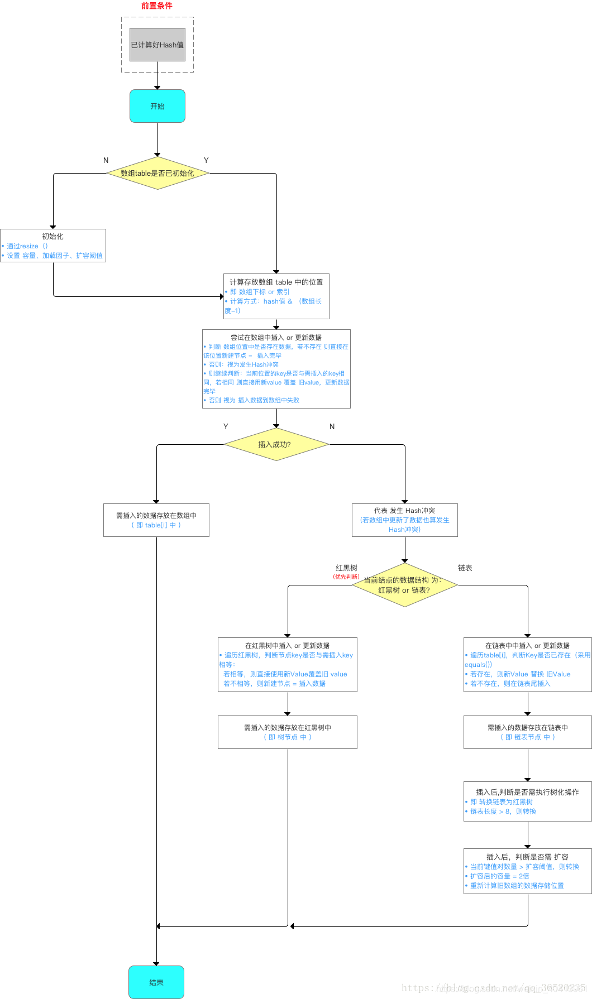

https://blog.csdn.net/weixin_45690436/article/details/109768120

https://blog.csdn.net/weixin_40413961/article/details/106740423

属性：

```java
初始容量 16 （这里是桶的数量）
 static final int DEFAULT_INITIAL_CAPACITY = 1 << 4; // aka 16

最大容量 2^30 次方 （桶的最大容量）
static final int MAXIMUM_CAPACITY = 1 << 30;

默认的装载因子
static final float DEFAULT_LOAD_FACTOR = 0.75f;

当一个元素被添加到有至少 TREEIFY_THRESHOLD 个节点的桶中，桶中链表将会被转换为树形结构
static final int TREEIFY_THRESHOLD = 8;

将树形结构转换为链表的最小节点
static final int UNTREEIFY_THRESHOLD = 6;

桶可能被转换成数结构的最小容量
static final int MIN_TREEIFY_CAPACITY = 64;

HashMap中存放KV的数量（为链表和树中的KV的总和）。
transient int size;

当HashMap的size大于threshold时会执行resize操作 threshold=capacity*loadFactor
int threshold;

final float loadFactor;
```


#### 约定

> 约定前面的数组结构的每一个格格称为**桶** 
> 约定桶后面存放的每一个数据称为**bin** 
> bin这个术语来自于JDK 1.8的HashMap注释。


​		当好多bin被映射到同一个桶时，如果这个桶中bin的数量小于 TREEIFY_THRESHOLD 当然不会转化成树形结构存储；如果这个桶中bin的数量大于了 `TREEIFY_THRESHOLD` ，但是capacity小于`MIN_TREEIFY_CAPACITY` 则依然使用链表结构进行存储，此时会对HashMap进行扩容；如果capacity大于了`MIN_TREEIFY_CAPACITY` ，则会进行树化。


###### putVal() 方法流程：




###### putVal 源码：

```java
final V putVal(int hash, K key, V value, boolean onlyIfAbsent,
                   boolean evict) {
        Node<K,V>[] tab; Node<K,V> p; int n, i;
       // 空表则初始化
        if ((tab = table) == null || (n = tab.length) == 0)
            n = (tab = resize()).length;
       //非空表且没有碰撞，则直接插入元素到散列表中
        if ((p = tab[i = (n - 1) & hash]) == null)
            tab[i] = newNode(hash, key, value, null);
        else {
            Node<K,V> e; K k;
            if (p.hash == hash &&
                ((k = p.key) == key || (key != null && key.equals(k))))
                e = p;
            else if (p instanceof TreeNode)
                e = ((TreeNode<K,V>)p).putTreeVal(this, tab, hash, key, value);
            else {
                for (int binCount = 0; ; ++binCount) {
                    if ((e = p.next) == null) {
                        p.next = newNode(hash, key, value, null);
                        if (binCount >= TREEIFY_THRESHOLD - 1) // -1 for 1st
                            treeifyBin(tab, hash);
                        break;
                    }
                    if (e.hash == hash &&
                        ((k = e.key) == key || (key != null && key.equals(k))))
                        break;
                    p = e;
                }
            }
            if (e != null) { // existing mapping for key
                V oldValue = e.value;
                if (!onlyIfAbsent || oldValue == null)
                    e.value = value;
                afterNodeAccess(e);
                return oldValue;
            }
        }
        ++modCount;
        if (++size > threshold)
            resize();
        afterNodeInsertion(evict);
        return null;
    }
```


###### resize() :

```java
final Node<K,V>[] resize() {
        Node<K,V>[] oldTab = table;
        int oldCap = (oldTab == null) ? 0 : oldTab.length;      / / 数组长度
        int oldThr = threshold;
        int newCap, newThr = 0;
       // 原数组长度大于0
        if (oldCap > 0) {
            if (oldCap >= MAXIMUM_CAPACITY) {
                threshold = Integer.MAX_VALUE;
                return oldTab;
            }
            else if ((newCap = oldCap << 1) < MAXIMUM_CAPACITY &&
                     oldCap >= DEFAULT_INITIAL_CAPACITY)
                // 阀值扩大为2倍
                newThr = oldThr << 1; // double threshold
        }
        else if (oldThr > 0) // initial capacity was placed in threshold
            newCap = oldThr;
        else {               // zero initial threshold signifies using defaults
            // 初始化阀值和容量
            newCap = DEFAULT_INITIAL_CAPACITY;
            newThr = (int)(DEFAULT_LOAD_FACTOR * DEFAULT_INITIAL_CAPACITY);
        }
        if (newThr == 0) {
            float ft = (float)newCap * loadFactor;
            newThr = (newCap < MAXIMUM_CAPACITY && ft < (float)MAXIMUM_CAPACITY ?
                      (int)ft : Integer.MAX_VALUE);
        }
        threshold = newThr;
        @SuppressWarnings({"rawtypes","unchecked"})
        Node<K,V>[] newTab = (Node<K,V>[])new Node[newCap];
        table = newTab;
    // 原数组不为空，把原数组复制到扩容后的数组
        if (oldTab != null) {
            for (int j = 0; j < oldCap; ++j) {
                Node<K,V> e;
                // 遍历数组
                if ((e = oldTab[j]) != null) {
                    oldTab[j] = null;
                    // 很单纯的节点，直接往新数组后面添加就行
                    if (e.next == null)
                        newTab[e.hash & (newCap - 1)] = e;
                    else if (e instanceof TreeNode)
                        // 树
                        ((TreeNode<K,V>)e).split(this, newTab, j, oldCap);
                    else { 
   			   /*链表*/
                        // 数组低位链表的首尾节点
                        Node<K,V> loHead = null, loTail = null;
                        // 数组高位链表的首尾节点
                        Node<K,V> hiHead = null, hiTail = null;
                        Node<K,V> next;
                        do {
                            next = e.next;
                            if ((e.hash & oldCap) == 0) {
                                if (loTail == null)
                                    loHead = e;
                                else
                                    loTail.next = e;
                                loTail = e;
                            }
                            else {
                                if (hiTail == null)
                                    hiHead = e;
                                else
                                    hiTail.next = e;
                                hiTail = e;
                            }
                        } while ((e = next) != null);
                        if (loTail != null) {
                            loTail.next = null;
                            newTab[j] = loHead;
                        }
                        if (hiTail != null) {
                            hiTail.next = null;
                            newTab[j + oldCap] = hiHead;
                        }
                    }
                }
            }
        }
        return newTab;
    }
```

