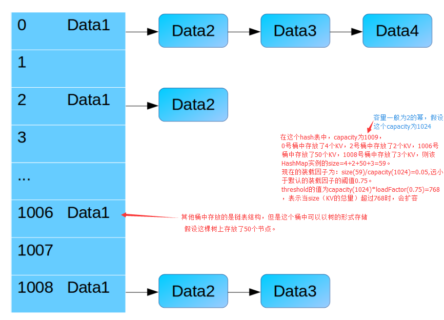
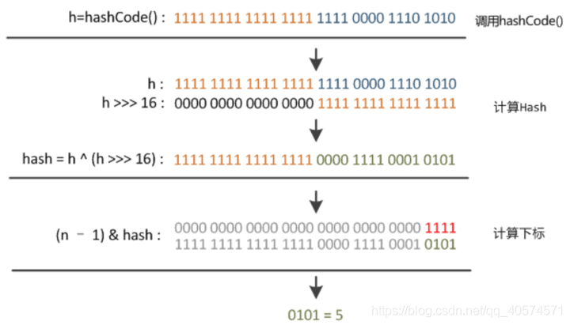
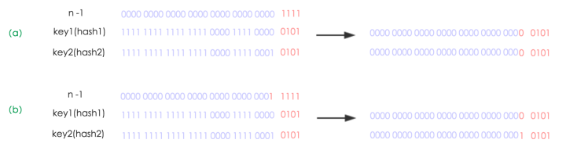
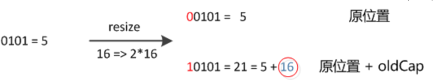
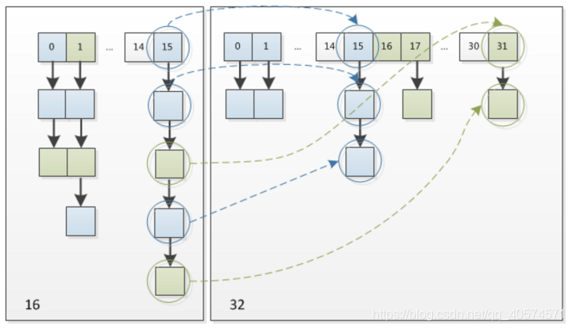
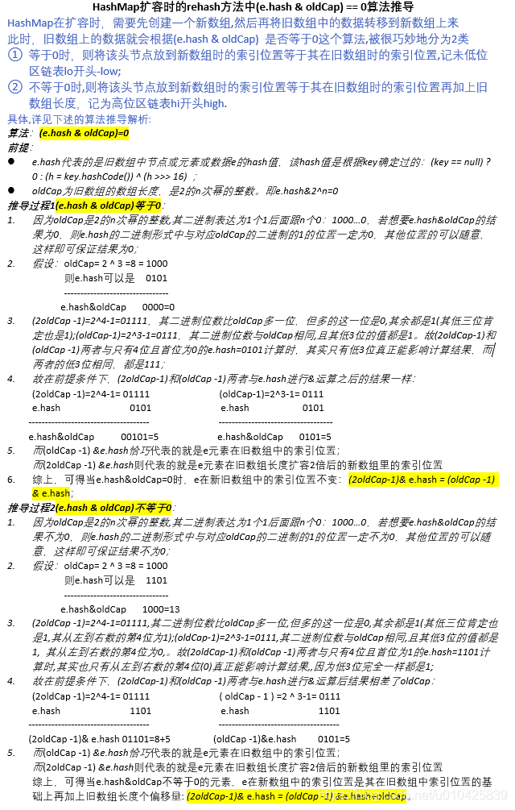

https://blog.csdn.net/weixin_45690436/article/details/109768120

https://blog.csdn.net/weixin_40413961/article/details/106740423

属性：

```java
初始容量 16 （这里是桶的数量）
 static final int DEFAULT_INITIAL_CAPACITY = 1 << 4; // aka 16

最大容量 2^30 次方 （桶的最大容量）
static final int MAXIMUM_CAPACITY = 1 << 30;

默认的装载因子
static final float DEFAULT_LOAD_FACTOR = 0.75f;

当一个元素被添加到有至少 TREEIFY_THRESHOLD 个节点的桶中，桶中链表将会被转换为树形结构
static final int TREEIFY_THRESHOLD = 8;

将树形结构转换为链表的最小节点
static final int UNTREEIFY_THRESHOLD = 6;

桶可能被转换成数结构的最小容量
static final int MIN_TREEIFY_CAPACITY = 64;

HashMap中存放KV的数量（为链表和树中的KV的总和）。
transient int size;

当HashMap的size大于threshold时会执行resize操作 threshold=capacity*loadFactor
int threshold;

final float loadFactor;
```





#### 约定

> 约定前面的数组结构的每一个格格称为**桶** 
> 约定桶后面存放的每一个数据称为**bin** 
> bin这个术语来自于JDK 1.8的HashMap注释。


​		当好多bin被映射到同一个桶时，如果这个桶中bin的数量小于 TREEIFY_THRESHOLD 当然不会转化成树形结构存储；如果这个桶中bin的数量大于了 `TREEIFY_THRESHOLD` ，但是capacity小于`MIN_TREEIFY_CAPACITY` 则依然使用链表结构进行存储，此时会对HashMap进行扩容；如果capacity大于了`MIN_TREEIFY_CAPACITY` ，则会进行树化。

****

#### put 源码：

```java
 public V put(K key, V value) {
        return putVal(hash(key), key, value, false, true);
    }
```

###### hash()

```java
static final int hash(Object key) {
        int h;
        return (key == null) ? 0 : (h = key.hashCode()) ^ (h >>> 16);
    }
```

***

#### putVal 源码：

```java
final V putVal(int hash, K key, V value, boolean onlyIfAbsent,
                   boolean evict) {
        Node<K,V>[] tab; Node<K,V> p; int n, i;
       // 空表则初始化
        if ((tab = table) == null || (n = tab.length) == 0)
            n = (tab = resize()).length;
       //非空表且没有碰撞，则直接插入元素到散列表中。这就相当于放入桶中第一个位置。
        if ((p = tab[i = (n - 1) & hash]) == null)
            tab[i] = newNode(hash, key, value, null);
        else {
            Node<K,V> e; K k;
            if (p.hash == hash &&
                ((k = p.key) == key || (key != null && key.equals(k)))) // 节点的key存在，则覆盖原value值。
                e = p;
            else if (p instanceof TreeNode) // 树节点，红黑树
                e = ((TreeNode<K,V>)p).putTreeVal(this, tab, hash, key, value);
            else { // 链表
                for (int binCount = 0; ; ++binCount) {
                    if ((e = p.next) == null) {
                        p.next = newNode(hash, key, value, null);
// 当binCount=7时，此时p指向的应该是链表的第8个节点，e = p.next指向第9个节点。
                        if (binCount >= TREEIFY_THRESHOLD - 1) // -1 for 1st 
                            treeifyBin(tab, hash); //链表长度大于8转换为红黑树进行处理
                        break;
                    }
                     // key已经存在直接覆盖value
                    if (e.hash == hash &&
                        ((k = e.key) == key || (key != null && key.equals(k))))
                        break;
                    p = e;
                }
            }
            if (e != null) { // existing mapping for key
                V oldValue = e.value;
                if (!onlyIfAbsent || oldValue == null)
                    e.value = value;
                afterNodeAccess(e);
                return oldValue;
            }
        }
        ++modCount;
        if (++size > threshold) // 超过最大容量，扩容
            resize();
        afterNodeInsertion(evict);
        return null;
    }
```

 n = (tab = resize()).length;

#### (n - 1) & hash 意义：

​	**HashMap**是“数组+链表”的结构，为了让**HashMap**里的元素分布的更加均匀，就要在数组中给每个元素一个合适的位置，求模运算是一个不错的方法。

> ###### 取模：一个数n 除以p 等于m和余数  n / p =m ······ r
>
> ##### 这个余数的范围是 [0,p)  
>
> ##### 意义：假如我们想在一个数你中得到[0,p]范围  就用n%p 得到的结果是就是在[0，p]这样一个范围
>
> ##### 53%18    就是53除以18 得到一个整数还有一个余数  这个余数的范围一定在[0,18]之间


```java
方法一：jdk 1.8 源码
static final int hash(Object key) {   //jdk1.8 & jdk1.7
     int h;
     // h = key.hashCode() 为第一步 取hashCode值
     // h ^ (h >>> 16)  为第二步 高位参与运算
     return (key == null) ? 0 : (h = key.hashCode()) ^ (h >>> 16);
}
方法二：
static int indexFor(int h, int length) {  //jdk1.7的源码，jdk1.8没有这个方法，但是实现原理一样的
     return h & (length-1);  //第三步 取模运算
}	
```

这里的Hash算法本质上就是三步：取key的hashCode值、高位运算、取模运算。

​		对于任意给定的对象，只要它的hashCode()返回值相同，那么程序调用方法一所计算得到的Hash码值总是相同的。我们首先想到的就是把hash值对数组长度取模运算，这样一来，元素的分布相对来说是比较均匀的。但是，模运算的消耗还是比较大的，在HashMap中是这样做的：调用方法二来计算该对象应该保存在table数组的哪个索引处。

​		这个方法非常巧妙，它通过h & (table.length  -1)来得到该对象的保存位，而HashMap底层数组的长度总是2的n次方，这是HashMap在速度上的优化。`当length总是2的n次方时，h& (length-1)运算等价于对length取模，也就是h%length，但是&比%具有更高的效率`。

​		在JDK1.8的实现中，优化了高位运算的算法，通过hashCode()的高16位异或低16位实现的：(h = k.hashCode()) ^ (h >>>  16)，主要是从速度、功效、质量来考虑的，这么做可以在数组table的length比较小的时候，也能保证考虑到高低Bit都参与到Hash的计算中，同时不会有太大的开销。

n为table的长度：




###### h& (length-1)运算等价于对length取模 原因：

​		这里有一个前提，**length**是一个**2**的幂次方整数（这也就解释了为什么扩容的时候，是按 2的幂次方整数扩容），这样，**length-1** 的二进制就是一个形如“0000111...”的数，比如，如果**length=4**，**length-1=3**，其二进制表示为“**0011**”，如果**length=8**，**length-1=7**，其二进制表示为“**0111**”，以此类推。将**h**和**length-1**进行按位与运算的时候，由于高位都是**0**，只有低位的**1**才能决定最终的结果，就相当于对**h**进行相应数值（即**length**）的求模运算。

****

#### resize() :

https://blog.csdn.net/weixin_41565013/article/details/93190786

https://blog.csdn.net/qq_40574571/article/details/97612100

```java
final Node<K,V>[] resize() {
        Node<K,V>[] oldTab = table;
        int oldCap = (oldTab == null) ? 0 : oldTab.length;      / / 数组长度
        int oldThr = threshold;
        int newCap, newThr = 0;
       // 原数组长度大于0
        if (oldCap > 0) {
            if (oldCap >= MAXIMUM_CAPACITY) {
                threshold = Integer.MAX_VALUE;
                return oldTab;
            }
            else if ((newCap = oldCap << 1) < MAXIMUM_CAPACITY &&
                     oldCap >= DEFAULT_INITIAL_CAPACITY)
                // 阀值扩大为2倍
                newThr = oldThr << 1; // double threshold
        }
        else if (oldThr > 0) // initial capacity was placed in threshold
            newCap = oldThr;
        else {               // zero initial threshold signifies using defaults
            // 初始化阀值和容量
            newCap = DEFAULT_INITIAL_CAPACITY;
            newThr = (int)(DEFAULT_LOAD_FACTOR * DEFAULT_INITIAL_CAPACITY);
        }
        if (newThr == 0) {
            float ft = (float)newCap * loadFactor;
            newThr = (newCap < MAXIMUM_CAPACITY && ft < (float)MAXIMUM_CAPACITY ?
                      (int)ft : Integer.MAX_VALUE);
        }
        threshold = newThr;
        @SuppressWarnings({"rawtypes","unchecked"})
        Node<K,V>[] newTab = (Node<K,V>[])new Node[newCap];
        table = newTab;
    // 原数组不为空，把原数组复制到扩容后的数组
        if (oldTab != null) {
            for (int j = 0; j < oldCap; ++j) {
                Node<K,V> e;
                // 遍历数组，把之前的桶移到新的桶中
                if ((e = oldTab[j]) != null) {
                    oldTab[j] = null;
                    // 很单纯的数组元素（即链表不存在后续节点），直接往新数组后面添加就行
                    if (e.next == null)
                        newTab[e.hash & (newCap - 1)] = e;
                    else if (e instanceof TreeNode)
                        // 树
                        ((TreeNode<K,V>)e).split(this, newTab, j, oldCap);
                    else { 
   			   /*桶中为链表，对链表进行拆分*/
			/*拆分成两个链表*/
                        Node<K,V> loHead = null, loTail = null;
                        Node<K,V> hiHead = null, hiTail = null;
                        // 链表的下一元素
                        Node<K,V> next;
                        do {
                            next = e.next;
                           // 选择出扩容后在同一个桶中的节点。
                            if ((e.hash & oldCap) == 0) {
                                // 尾节点为空，说明 lo 链表为空
                                if (loTail == null)
                                    loHead = e;
                                else
                                    loTail.next = e;
                                loTail = e;
                            }
                            else {
                                if (hiTail == null)
                                    hiHead = e;
                                else
                                    hiTail.next = e;
                                hiTail = e;
                            }
                        } while ((e = next) != null); // 循环遍历链表元素，构建两个链表
                        // 解释了之前为什么需要把尾节点为空的赋值为e
                        if (loTail != null) {
                            // 把上次用作标记尾节点的节点去除。
                            loTail.next = null;
                            newTab[j] = loHead;
                        }
                        if (hiTail != null) {
                            hiTail.next = null;
                            // 新节点的位置是现在的位置加之前 table 长度的。因为是2次幂的扩展。
                            newTab[j + oldCap] = hiHead;
                        }
                    }
                }
            }
        }
        return newTab;
    }
```

- ###### 扩容位置变化分析：


https://blog.csdn.net/qq_40574571/article/details/97612100

​		jdk1.8 使用的是2次幂的扩展(指长度扩为原来2倍)，所以，元素的位置要么是在原位置，要么是在原位置再移动2次幂的位置。看下图可以明白这句话的意思，n为table的长度，图（a）表示扩容前的key1和key2两种key确定索引位置的示例，图（b）表示扩容后key1和key2两种key确定索引位置的示例，其中hash1是key1对应的哈希与高位运算结果。扩容一倍，左移一位，故新的 n-1 位是之前  n-1 左移动一位。



​		元素在重新计算hash之后，因为n变为2倍，那么n-1的mask范围在高位多1bit(红色)，因此新的index就会发生这样的变化：



​		因此，我们在扩充HashMap的时候，不需要像JDK1.7的实现那样重新计算hash，只需要看看原来的hash值新增的那个bit是1还是0就好了，是0的话索引没变，是1的话索引变成“原索引+oldCap”，可以看看下图为16扩充为32的resize示意图：




- ###### e.hash & oldCap == 0 算法：


https://blog.csdn.net/u010425839/article/details/106620440/



简单的说，存的是 e.hash & (oldCap - 1),这时候是位置，而 e.hash & oldCap 时，因为 oldCap 的长度是2的n次幂整数，所以计算结果肯定是0.这里关注 e.hash 的值。

****

#### putTreeVal()

(红黑树)

2-3 树

https://zhuanlan.zhihu.com/p/104031183

红黑树

https://www.cnblogs.com/shianliang/p/9233117.html

putTreeVal()  方法

https://www.cnblogs.com/shianliang/p/9233024.html