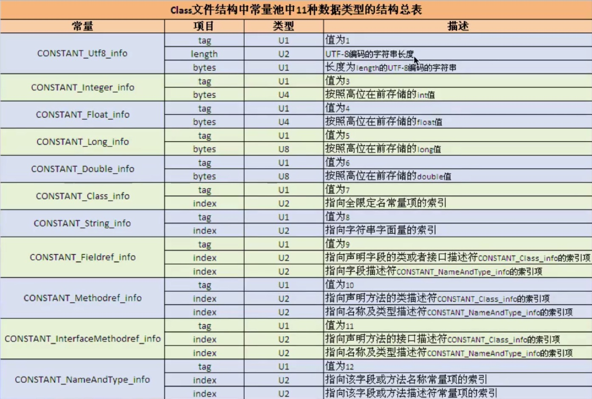
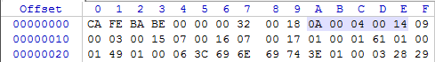

#### 常量池(constant pool)

> 1、     紧接着主主版本号之后的就是常量池入口。一个java类中定义的很多信息都是由常量池来维护和描述的，可以将常量池看做是 Class 文件的资源仓库，比如说 Java类中定义的方法与变量信息，都是存储在常量池中。
>
> 2、      常量池中主要存储两类常量：字面量和与符号引用。字面量如文本字符串，Java中声明为 final 的常量值等，而符号引用如类的全局限定名，字段的名称和描述符，方法的名称和描述符等。
>
> ​        常量池的总体结构：Java 类所对应的常量池主要由常量池数量与常量池数组这两部分共同构成。常量池紧跟在主版本号后面，占据 两个字节；常量池数组则紧跟在常量池数量之后。常量池数组与一般的数组不同的是，常量池数组中不同的元素的类型、结构都是不同的，长度当然也就不同，但是每一种元素的第一个数据都是一个一个 u1 类型，该字节是个标志位，占据1个字节。JVM 在解析常量池时，会根据这个 u1 类型来获取元素的具体类型。值得注意的是，常量池数组中元素的个数 = 常量池数 -1。（其中 0 暂不使用），目的是满足某些常量池索引值的数据在特定情况下需要表达【不引用任何一个常量池】的含义；根本原因在于，索引值为 0 也是一个常量（保留常量），只不过它不位于常量表中，这个常量就对应 null 值；所以，常量池的索引从 1 而非 0 开始。
>
> 3、   在jvm 规范中，每个变量/ 字段都有描述信息，描述信息主要作用是描述字段的数据类型、方法的参数列表（包括数量、类型与顺序）与返回值。根据描述规则，基本数据类型和代表无返回值的 void 的类型都用一个大写字符来表示，对象类型则使用字符 L 加对象的全限定名称来表示。为了压缩字节码文件的体积，对于基本数据类型，JVM都只使用一个大写字母来表示，如下所示：
>
> B - byte，C - char，D - double，F - float，I - int，J - long， S - short ，Z - boolean，V - void,
>
> L - 对象类型，如 Ljava/lang/String
>
> 4、    对于数组来说，每一个维度使用一个前置的 [ 来表示，如 int[] 被记录为 [I, String[] []被记录为 [[LJava/lang/String；
>
> 5、用描述符来描述方法的时候，按照先参数列表，后返回值的顺序来描述。参数列表按照参数的严格顺序放在一组（）之内，如方法：String getName( int id , String name) 的描述符为：(I,Ljava/lang/String;)Ljava/lang/String;


##### 常量池在字节码文件中的位置

在class文件中的魔数、副版本号、主版本之后，紧接着就是常量池的数据区域了，如下图用红线包括的位置：


##### 常量池结构：



上面的表中描述了 11 种数据类型，其实在 jdk 1.7 之后又增加了 3 种，CONSTANT_MethodHandle_info,CONSTANT_MethodType_info,CONSTANT_InvokeDynamic_info.

***


#### 具体分析：

##### Java 代码：

```java
package com.jvm.bytecode;

public class MyTest1 {
    private int a = 1;

    public int getA() {
        return a;
    }

    public void setA(int a) {
        this.a = a;
    }
}

```


##### class文件：



##### 反编译结果：

第一个常量池项 #1：

u1 值为0A,十进制11： CONSTANT_Methodref_info。由表知，后 4 位，声明这个方法的类和方法名称及类型描述符的索引项，分别为 4 和 20。这里并不直观，直接查看反编译文件：

u2 ，u1后两位，值为04，十进制4：索引指向常量池第四项#4，#4引用#23，返回方法所属类的完全限定名 java/lang/Object

u2，u2后两位， 值为14，十进制20：索引指向常量池第二十项#20，#20引用#7，#8。#7返回方法名称 <init>，<init> 代表的是构造方法，默认生成的。#8返回描述信息（）v，这里表示的是参数为空，没有返回值的方法。

整个方法的信息则是 java/lang/Object."<init>":()V。即方法所属类.方法名称：(参数列表)返回值类型


第二个常量池项 #2：

u1值为09 ：CONSTANT_Fieldref_info。后4位，声明字段的类或接口和字段描述符的索引。

u2 ，u1后两位，值为03，十进制3：索引指向常量池第三项#3，#3引用22，返回字段所属类名称 com/jvm/bytecode/MyTest1

u2 ，u2后两位，值为15，十进制21：索引指向常量池第二十一项#21，#21引用#5，#6。#5返回名称 a,#6返回描述信息 I。

整个字段的信息则是 com/jvm/bytecode/MyTest1.a:I。即字段所属类.字段名称：字段类型


第三个常量池项 #3：

u1值为07：CONSTANT_Class_info。后两位，类的全限定名

u2，u1后两位，值为16,十进制20：索引指向索引指向常量池第二十项#20，返回类的全限定名称。


第五个常量池 #5：

u1值为01：CONSTANT_Utf8_info

u2，u1后两位，值为01，十进制1：表示后面字符串长度为1，即只选择一个字节。

u1，u2后一位，值为61：表示的是ASCII 的a。这里的一位表示的是每一位数字对应的都是ASCII码表的一个字符。


其余相同的就不分析了。。。。。。

```java
Constant pool:
   #1 = Methodref          #4.#20         // java/lang/Object."<init>":()V
   #2 = Fieldref           #3.#21         // com/jvm/bytecode/MyTest1.a:I
   #3 = Class              #22            // com/jvm/bytecode/MyTest1
   #4 = Class              #23            // java/lang/Object
   #5 = Utf8               a
   #6 = Utf8               I
   #7 = Utf8               <init>
   #8 = Utf8               ()V
   #9 = Utf8               Code
  #10 = Utf8               LineNumberTable
  #11 = Utf8               LocalVariableTable
  #12 = Utf8               this
  #13 = Utf8               Lcom/jvm/bytecode/MyTest1;
  #14 = Utf8               getA
  #15 = Utf8               ()I
  #16 = Utf8               setA
  #17 = Utf8               (I)V
  #18 = Utf8               SourceFile
  #19 = Utf8               MyTest1.java
  #20 = NameAndType        #7:#8          // "<init>":()V
  #21 = NameAndType        #5:#6          // a:I
  #22 = Utf8               com/jvm/bytecode/MyTest1
  #23 = Utf8               java/lang/Object
```

