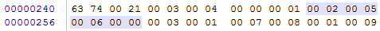

#### 字段表集合：

> ​        字段表用于描述类和接口中声明的变量。这里的字段包含了类级别变量以及实例变量，但是不包括方法内部声明的局部变量。


##### 字段表结构：


##### 举例说明：

##### class文件：




##### 反编译结果：

0x 00 02：字段的访问控制符为私有

0x 00 05：名称的索引，索引为常量池的第5项，这里的字段名称为 a

0x 00 06 ：字段的描述，索引为常量池的第6项，根据定义字段的描述为其类型，I

0x 00 00 ：说明属性总数为0，故没有后面的属性项的信息。


```java
Constant pool:
......
     #5 = Utf8               a
     #6 = Utf8               I
......
```

