#### 方法表：

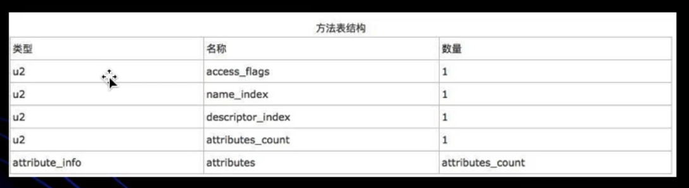

前三个和字段和 field_info一样。


#### 方法结构：

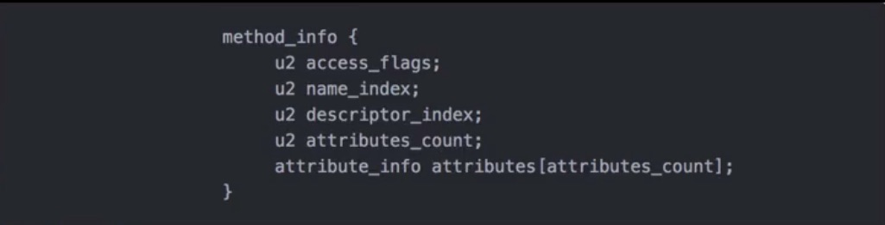

***


#### 方法属性结构：

> * jvm预定了部分 attribute，但是编译器自己也可以实现自己的 attribute 写入 class 文件里，供运行时使用。
> * 不同的 attribute 通过 attribute_name_index 来区分。
> * 方法属性不等于局部变量。


#### Code_attribute（Code 就是方法的属性之一）：

> Code attribute 的作用是保存该方法的结构，如下所对应的字节码。
>
> 这里的 Code_attribute 值得是在常量池中名称为 Code 的方法属性。则按照 Code 的结构来阅读字节码，不需要再看上面的方法属性结构。

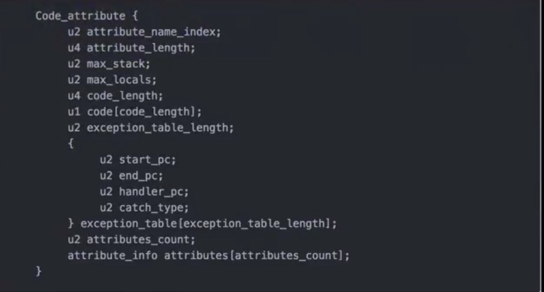


* attribute_length表示 attribute 所包含的字节数，不包含attribute_name_index和attribute_length本身字段

* max_stack 表示这个方法运行的任何时刻所能达到的操作数栈的最大深度
* max_locals 表示方法执行期间创建的局部变量的数目（执行期间创建的局部变量可能是jvm做的事，我们看不见这个变量。而 args_size 代表的是入参个数），包含用来表示传入的参数的局部变量
* code_length 表示该方法所包含的字节码的字节数以及具体的指令码.从这个开始向后数 code_length  个字节才是真正执行的命令。
* code[code_length] 具体字节码即是该方法被调用时，虚拟机所执行的字节码,即反编译完代码那段。
* exception_table，这里存放的是处理异常的信息
* 每个 exception_table 表项由 start_pc, end_pc,  handler_pc, catch_type组成
* start_pc 和 end_pc 表示在 code 数组中的从 start_pc 到 end_pc 处（包含start_pc，不包含end_pc）的指令抛出的异常会由这个表项来处理
* handler_pc 表示处理异常的代码的开始处。catch_type 表示会被处理的异常类型，它指向常量池的一个异常类。当catch_type为0时，表示处理所有的异常


##### 举例分析：

由下图可知，code_length 为 16，即后面 16 为都为 code 的内容。

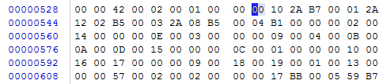

下面的 Bytecode 的内容 0 -15 表示的就是16位。

如 2A，*在官方的说明中助记符就是 aload_<n> （注意助记符真实并不存在于字节码文件中，是为了方便查看，真实的还是字节码文件中的 16 进制*）

1 - 4 中间隔的两位则是 invokespecial 的参数索引，即B7 后两位，00 001，指向常量池第一项。

后面的 5 -7 直接隔一个字符原因应该是字符串索引算一个字节。

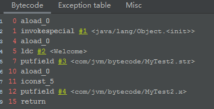


 1: invokespecial #1                  // Method java/lang/Object."<init>":()V

这行后面的这个代表的是这个 invokespecial  方法的参数。表示调用自己的私有方法，构造方法（<init>）以及父类的方法。

注意：java字节码并不是会强制要求每个 method 里面都有 <init> 方法，因为这个方法的生成是因为java语言本身的规范，和jvm规范不一样。java编译器是会自动生成没有的构造方法是因为 java 语言规范的要求。


##### exception_table 属性：


***

#### 附加属性：

##### 1、line_number_table 属性：

这个附加属性就是code 结构里最后的 attribute_count后attribute_info 的内容。

u2 attributes_count 代表的就是方法的额外属性，不是方法的成员变量，是编译器生成的。

> LineNumberTable：这个属性用来表示code数组中的字节码和java代码行数之间的关系。这个属性可以用来在调试的时候定位代码执行的行数

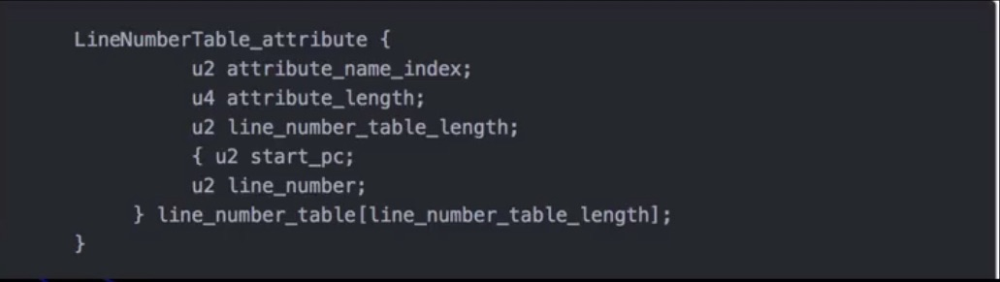

start_pc : 字节码的偏移量，这里的start_pc  和上面的不同

LineNumber：映射到源代码的行号

##### 举例分析：

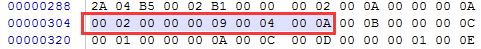

0x 00 0A：10，常量池第十项， 表示是 LineNumberTable属性

0x 00 00 00 0A：代表的是attribute_length 表示 attribute 所包含的字节数，不包含attribute_name_index和attribute_length本身字段

0x 00 02：line_number_table_lenth，表示有两对映射，即后面8个字节码分为两部分。

{

0x 00 00：表示离 line_number_table_lenth 这个字节码的偏移量，这里就是 0，代表第一个

0x 00 09：代表这个映射到源文件的第九行。这里动idea看见构造方法在 类名称这里，原因是不是自己生产的，编译器自动在这里生成构造方法。

0x 00 04，0x 00 0A 同上面这对。

}


##### 2、  Local_Variable_Table 属性：

> 局部变量表。

##### 举例分析（图同上）：

0x 00 0B:11,常量池第十一项，表示的是 LocalVariableTable。

0x 00 00 00 0C：属性长度。

0x 00 01：方法的局部变量个数 1。

>  注意，这里无参构造方法为什么会有局部变量（这里的局部变量就是this）
>
>  原因：在java里面，每一方法都可以访问 this，即对象本身，但是在源码角度，this 是作为第一个参数传入方法。这样就使得每一个实例对象里面都有 this。即如果某个方法是 非static的，此方法至少拥有一个局部变量 this，this指向的就是当前对象本身，在反编译文件中体现为 args_size 比方法的传入参数多一个。 
>
>  还得注意：这里此类的无参构造是 Object 类的无参构造方法，不是本类的，因为所有的类都默认继承 Object类。

{

0x 00 00：局部变量开始位置

0x 00 0A：局部变量结束位置

。。。还有没完的。

}

****

#### 分析构造方法和静态变量：

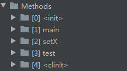

<init>  默认构造方法，所有的实例变量都会在这里初始化。在默认没有写构造方法的时候，编译器会自动添加无参构造方法。

<clinit> 类变量的初始化方法。

##### 举例：

```java
public class MyTest(){
    String str = "Welcome";

    private int x= 5;

    public static Integer in = 10;
    
    public MyTest(){
        
    }

    public MyTest(int i){
        
    }
}
```

###### 成员变量：

 str 和 x 都是在构造方法里面完成赋值的，即使没有手动书写构造方法，编译器都会默认添加。切记：这里成员变量赋值是在构造方法里面！！！！！！！！！！！

即使有两个构造方法，它们执行代码的内容都是一样，都会为成员变量赋值。

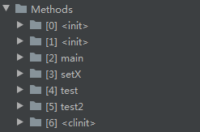


###### 类变量：

首先，所有静态代码块和类变量会合并成一个静态代码块（即使只有类变量，也会生成这个静态代码块），然后会在 <clinit> 方法中初始化。

***


#### 分析 this 和 异常处理：

##### this：

​        对于 Java 类中的每一个实例方法（非 static方法，因为static方法是属于 Class对象的），其在编译后生成的字节码中，方法的参数数量总是会比源代码中方法的参数的数量多一个（this），它位于方法的第一个参数位置处；这样，我们就可以在java的实例方法中使用this来去访问当前对象的属性及其他方法。   

​        这个操作是在编译器完成的，即由javac编译器在编译的时候将对this的访问转换为对一个普通实例方法参数的访问，接下来在运行期间，由JVM在调用实例方法的时，自动向实例方法传入该this参数。所以，在实例方法的局部变量表中，至少会有一个指向当前对象的局部变量。


##### Java 字节码对于异常的处理方式：

1、统一采用异常表的方式来对异常进行处理。

2、在 JDK 1.4.2 之前版本中，并不是使用异常表的方法来对异常进行处理的，而是采用特定的指令方式。

3、当异常处理存在 finally 语句块时，现代化的JVM采取的处理方法是将finally语句块的字节码拼接到每一个catch块后面。  换句话说，程序中存在多少个 catch 块，就会在每一个catch块后面重复多少个finally语句块的字节码。


```JAVA
public class MyTest3 {
    public void test() throws FileNotFoundException,IOException{
        try{
            InputStream is = new FileInputStream("test.java");

            ServerSocket serverSocket = new ServerSocket(9999);
            serverSocket.accept();
        } catch (FileNotFoundException e) {

        } catch (IOException e) {

        }catch (Exception e){

        }finally {
            System.out.println("finally");
        }
    }
}
```

当使用catch语句执行的时候，结果如下：

这里的 any 则表示可以处理前面 catch所有不能处理的异常，这个是编译器在编译的时候自动生成的：

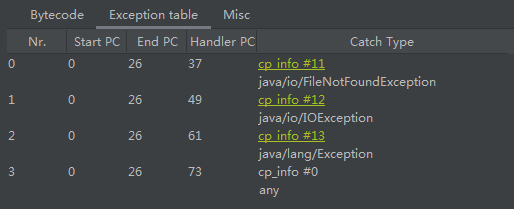

​         当使用 throws 时，如下，方法会生成一个属性，对应的是常量池的33项，并不是和 catch 一样会在方法的字节码中执行出来。所以，catch 比 throw 要复杂，也是因为如此，throw并不是解决异常，只是向上抛出异常。

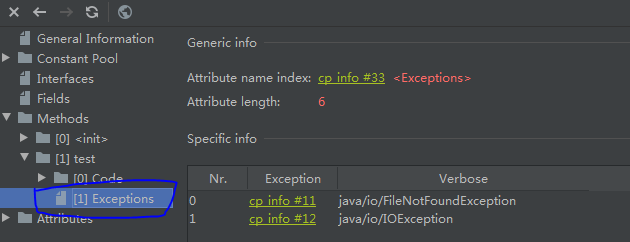


***


javap -verbose 不会打印私有的方法的信息，javap -verbose -p 加上 -p 参数会显示所有的信息


##### 字节码查看工具：

jclasslib 插件，它可以可视化已编译的Java类文件和所包含的字节码的所有方面。比 javap -ververbose  更详细。

https://github.com/ingokegel/jclasslib


