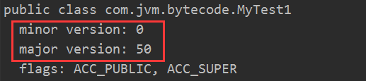

##### 字节码文件的组织结构（表示方式1）：

图片解释：

- 4个字节 Magic Number 魔数值为0xCAFEBABE
- 2+2个字节 Version 前两个字节表示minor version（次版本号），后两个字节表示major version（主版本号）。1.1（45），1.2（46），1.3（47），1.4（48），1.5（49），1.6（50），1.7（51）
- 2+ n个字节 Constant Pool    2代表两个字节，表示常量池总数（下同）。的包括字符串常量、数值常量等
- 2个字节 Access Flags 访问标志（public class 、private class 等）
- 2个字节 This Class Name  本类名称
- 2个字节 Super Class Name  父类名称
- 2+n个字节 Interfaces    接口的数量为 2+ n的原因是java类可以实现多个接口
- 2+n个字节 Fields 当前这个类的成员变量的信息
- 2+n个字节 Methods  
- 2+n个字节 Attributes 当前这个类的附加的属性

##### 字节码文件的组织结构（表示方式2）：

##### Class字节码中有两种数据类型：

* 字节数据直接量：这是基本的数据类型。共细分为 u1、u2、u4、u8四种，分别代表连续的 1个字节、2 个字节、4个字节、8个字节组成的整体数据。
* 表（数组）：表是由多个基本数据或其他表，按照既定顺序组成的大的数据集合。表是有结构的，它的结构体现在：组成表的成分所在的位置都是已经严格定义好的。最典型的就是常量池表。

##### 补充：

一个字节 8 位二进制，一个 16 进制 = 4 位二进制，故1个字节 = 2 个16 进制.（1111 = f）

如下，CA 是两位十六进制，表示一个字节。

​		

***

#### 1、魔数

> ​        所有的 .class 字节码文件的前 4 个字节都是魔数，魔数值为固定值：0xCAFEBABE （十六进制必须0x 开头）

如果不是这四个字节开头的，一定不是合法的字节码文件。（通过 winhex 查看的 .class 文件）

***

#### 2、版本号

> ​        魔数之后的四位是版本信息，前两个字节表示 minor version（次版本号），后两个字节表示 major version （主版本号）

##### 反编译结果：

次版本号是 0，主版本号是 50. (这里是十进制的),50对应的是jdk6，52对应的是 jdk 8。所以该文件的版本号为：1.6.0。

 jdk 是向下兼容的，版本号为 1.8 的可以识别和加载 1.8 之前生成的字节码文件。

可以通过 java -version 查看版本：

0 之后的那个不是 次版本号，是更新版本号，一般在官方网站显示为 1.8.0u221 这样。

##### 源文件：

前两位代表此版本号，后两位代表主版本号。

***

#### 4、Access_Flag 访问标志符

> ​     访问标志符信息包括该 Class文件是类还是接口，是否被定义成 public，是否是 abstract，如果是类，是否被声明成 final。通过上面的源代码，我们知道该文件是类并且是 public。

0x 00 00 代表是没有访问修饰符号。

注意：

这里发现字节码文件出现 21 并不在上面表中，这是因为 jvm 会把所有的标志符做并集处理。

0x 00 21： 是0x 0020 和0x 0001 的并集，表示ACC_PUBLIC与 ACC_SUPER，表示本类是 public类且可以调用父类的方法。

****

***

5、本类名

6、父类名

7、接口个数和接口信息

10、字节码文件的属性