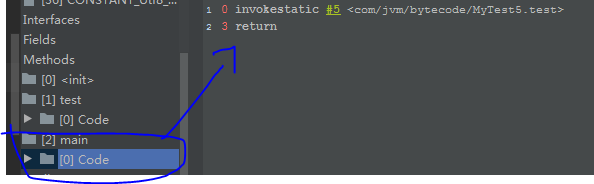
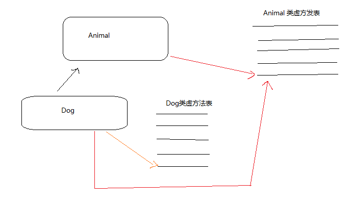

#### 栈帧（stack frame）：

​		栈帧是一种用于帮助虚拟机执行方法调用与方法执行的数据结构。栈帧本身是一种数据结构，封装了方法的局部变量表、动态链接信息、方法的返回地址以及操作数栈等信息。

动态链接：符号引用，直接引用。

符号引用：是指在A类里面调用B类的时候，会在A的常量池维护一个指向B的唯一限定名称，如果引用B的属性或者调用B的方法等，就会将符号引用转换为直接引用。

直接引用：可以直接在内存中寻找到被调用的方法的地址。

##### 符号引用转换为直接引用：

​		有些符号引用是在类加载阶段或时第一次使用时就会转换为直接引用，这种转换叫做静态解析；另外一些符号引用则是在每次运行转换为直接引用（即使是同一个符号引用在运行期后都可能被解析成不同的直接引用，详解下面的方法重写），这种转换叫做动态链接，（动态连接是一个将符号引用解析为直接引用的过程）。这体现为 Java 的多态。

##### 静态解析的4 中情形：

1、父类的方法

2、静态方法

3、构造方法

4、私有方法（private），原因是私有方法是不能被重写的的，故而可以在加载的时候就可以唯一确定。

以上四种方法称为非虚方法，他们是在类加载阶段就可以将符号引用转换为直接引用。


#### slot：

存储局部变量的最小单位。

​         虚拟机没有指明Slot的大小，但在jvm中，long和double类型数据明确规定为64位，这两个类型占2个Slot，其它基本类型固定占用1个Slot。读取的时候也会连续的读取两个 slot，表明这是 long 或者double类型。

一般来说，有几个局部变量，就会有几个 slot存储，但是不绝对。因为slot是可以复用的，因为在方法体中会存在更小的作用域。

##### 复用情况的分析：

如下，在方法体中的都是方法的局部变量，在局部变量角度，它表并不区分这些局部变量有什么作用域之分。但是实际运行的时候这些变量其实会有作用域之分，比如 b，c值只存在于 if之中。在运行的时候，在if执行完后，bc占据的slot位置就有可能被de占据，只是有可能，具体和虚拟机的实现有关。

```java
public class MyTest4 {
    public void test(){
        int a = 3;
        if (a<4){
            int b = 4;
            int c = 5;
        }
        
        int d = 7;
        int e = 8;
    }
}
```


***


> 1、invokeinterface：调用接口的默认实现方法，实际上是在运行期决定的，决定到底调用实现该接 口的哪个对象方法。
>
> 2、invokestatic：调用静态方法。
>
> 3、invokespecial：调用自己的私有方法，构造方法（<init>）以及父类的方法。
>
> 4、invokevirtual：调用虚方法，运行期动态查找的过程。
>
> 5、invokedynamic：动态调用方法。（自己的理解是普通的方法的调用）

 2、3 可以调用的方法是在解析阶段就可以确定的方法，符合这个类型的方法主要有四类：父类的方法，静态方法，构造方法，私有方法（private）。即他们在加载的时候就会直接把类的符号引用转化为直接引用。


##### 1、调用静态方法分析 （invokestatic）

```java
public class MyTest5 {

    public static void test(){
        System.out.println("test invoked");
    }

    public static void main(String[] args) {
        test();
    }
}
```

通过字节码可以发现，这里main方法通过 invokestatic 调用了静态方法test。




##### 2、重载的分析（invokespecial）：

```java
/*
*   方法的静态分配：
*   Grandpa p1 = new Father();
*   以上代码，p1 的静态类型是Grandpa，而p1的实际类型（真正指向的类型）是 Father。静态类型本身是不会改变的。
*   实际类型是在运行期间才可确定。
* */
public class MyTest6 {

    // 方法的重载，是一种静态行为，编译期就可以完全确定。jvm是根据方法参数的本身类型去决定调用的方法。
    public void test(Grandpa grandpa){
        System.out.println("gradpa");
    }

    public void test(Father father){
        System.out.println("father");
    }

    public void test(Son son){
        System.out.println("son");
    }

    public static void main(String[] args) {
        Grandpa p1 = new Father();
        Grandpa p2 = new Son();

        MyTest6 myTest6 = new MyTest6();

        myTest6.test(p1);
        myTest6.test(p2);
    }
}

class Grandpa{

}

class Father extends Grandpa{

}

class Son extends Father{

}
```


```java
 0 new #7 <com/jvm/bytecode/Father>
 3 dup
 4 invokespecial #8 <com/jvm/bytecode/Father.<init>> // 静态分派，构造方法属于静态分派
 7 astore_1
 8 new #9 <com/jvm/bytecode/Son>
11 dup
12 invokespecial #10 <com/jvm/bytecode/Son.<init>>
15 astore_2
16 new #11 <com/jvm/bytecode/MyTest6>
19 dup
20 invokespecial #12 <com/jvm/bytecode/MyTest6.<init>>
23 astore_3
24 aload_3
25 aload_1
26 invokevirtual #13 <com/jvm/bytecode/MyTest6.test>
29 aload_3
30 aload_2
31 invokevirtual #13 <com/jvm/bytecode/MyTest6.test>
34 return
```

invokespecial 只会调用自己的私有方法，构造方法（<init>）以及父类的方法，而类的其他方法则是会通过 invokevirtual 去调用，动态分配。


##### 3、重写的分析（invokevirtual）：

源码：

```java
public class MyTest7 {
    public static void main(String[] args) {
        Fruit apple = new Apple();
        Fruit orange  = new Orange();

        apple.test();
        orange.test();

        apple = new Orange();
        apple.test();
    }
}

class Fruit {
    public void test(){
        System.out.println("Fruit");
    }
}

class Apple extends Fruit {
    public void test(){
        System.out.println("Apple");
    }
}

class Orange extends Fruit{
    public void test(){
        System.out.println("Orange");
    }
}
```

字节码分析：

```java
 0 new #2 <com/jvm/bytecode/Apple> // new 代表在堆空间开辟内存空间，存放新的实例对象
 3 dup   // 复制操作数栈上的顶部值，并将复制后的值压入操作数栈。
 4 invokespecial #3 <com/jvm/bytecode/Apple.<init>> // 调用构造方法
 7 astore_1 // 将对象在堆上的实例对象的地赋值给变量。即将实例对象地址赋值给局部变量表的第一项。
 8 new #4 <com/jvm/bytecode/Orange> // 同上
11 dup
12 invokespecial #5 <com/jvm/bytecode/Orange.<init>>
15 astore_2
16 aload_1  // 从局部变量表加载索引为1的引用，即 apple。
17 invokevirtual #6 <com/jvm/bytecode/Fruit.test> //这里和实际调用的方法是不一样，原因在下面。
20 aload_2
21 invokevirtual #6 <com/jvm/bytecode/Fruit.test>
24 new #4 <com/jvm/bytecode/Orange>
27 dup
28 invokespecial #5 <com/jvm/bytecode/Orange.<init>>
31 astore_1
32 aload_1
33 invokevirtual #6 <com/jvm/bytecode/Fruit.test>
36 return
```

方法的动态分派：方法的动态分派设计到一个重要概念:方法接收者。

##### invokevirtual字节码指令的多态查找过程：

> 1、找到操作数栈的栈顶元素所指向的对象的实际类型。
>
> 2、如果在实际类型当中，它寻找到了与常量池中名称和描述符相同的方法，并且具有相应的访问权限，就直接返回这个方法的直接引用。如果找不到，依次从子类到父类重复查找的流程。直到真正找到特定的对象的方法。

比较方法重载和方法重写：方法重载是静态分派的，是编译器行为；方法重写是动态分派的，是运行期行为。多态与方法重写有紧密联系。动态分配是由方法调用决定的。

上面的例子，在invokevirtual执行的时候，会查找栈顶元素，这时候是Apple类，即会查找Apple类常量池中是否有相同名称和描述符的方法，这里有test方法，并且权限等于父类test方法的权限，故而调用这个方法。因此，即便是完全相同的两个符号引用，这里是 Fruit，在运行期也会被解析为两个不同的直接引用。


##### 虚方法表：

​		   针对于方法调用的动态分配的过程，虚拟机会在类的方法区建立一个虚方法表的数据结构（virtual method table，vtable）针对于 invokeinterface 指令来说，虚拟机会建立一个叫做接口方法表的数据结构（interface method table，itable）

​       虚方法表中存放的是每一个方法实际真正调用入口的地址，如果子类没有重写父类的方法，则子类的虚方法表中指向的是父类的虚方法表中方法的地址，如果子类重写了父类方法，则子类的虚方法表中就会标识这个方法，指向本类的此方法地址。




动态分配，静态分配。

符号引用，直接引用。


