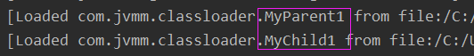
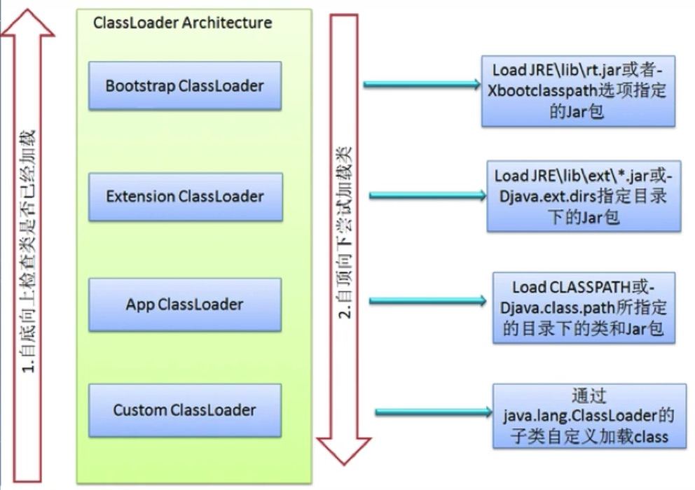

java是跨平台原因：

​      Java虚拟机消除了各个平台之间的差异，只要操作系统平台下安装了Java虚拟机，那么使用Java开发的东西都能在其上面运行。

​       Java虚拟机对各个平台而言，实质上是各个平台上的一个可执行程序。例如在windows平台下，java虚拟机对于windows而言，就是一个java.exe进程而已。

在如下几种情况中，java 虚拟机 将会结束生命周期：

* 执行了 System.exit() 方法
* 程序正常执行结束
* 程序在执行过程中遇到了异常或错误而异常终止
* 由于操作系统出现错误而导致 Java 虚拟机进程终止

***

### 类的加载、连接与初始化 阶段

- [x] `类的加载、连接和初始化都是在运行期间完成的。`

1、加载：查找并加载类的二进制文件

2、连接：

1. 验证：确保被加载的类的正确性

2. 准备：为类的 `静态变量` 分配内存，并将其初始化为默认值

3. 解析：把类中的符号引用转换为直接引用

   注意连接的准备阶段，已经分配内存给静态变量了，故而类不需要实例化就能调用它。而实例变量则是在实例化以后才会分配内存。

3、初始化：为类的静态变量赋予正确的初始值

静态变量的初始化有两种途径：（1）在静态变量的声明处进行初始化。（2）在静态代码块中初始化。静态变量的声明语句，以及静态代码块都被看做类的初始化语句，java虚拟机会按照语句在类文件中的先后顺序来依次执行它们 (这也静态代码块只会摆加载一次的原因，类只会被初始化一次)。

###### 类初始化步骤：

* 假如这个类还没有被加载和连接，那就首先进行加载和连接
* 假如类存在直接父类，并且这个父类还没有被初始化，那就先初始化直接父类
* 假如类中存在初始化语句，那就依次执行这些初始化语句


例子：

````java
class Test{
    public static int a = 1;    //在静态变量的声明处进行初始化。
    
    static { 
        b = 2;   //  在静态代码块中初始化
    }
}
````

​		这里在连接的准备阶段,会把 a 赋值为默认的0，因为在准备阶段，是没有类的实例。而在初始化阶段才会赋值为 1。

4、使用：使用类的实例

5、卸载：不使用这个类，从内存中去除。 


标准的生命周期：


<init> 方法是对实例变量的初始化。

##### 对于类变量的补充：

成员变量就是类里面的变量，不区分static。没有static的成员变量叫实例变量，加了static就叫类变量。

```java
class Test{
     
    public static String CLASS_VAR = "test";//类变量、静态变量、全局变量
     
    private String instance_var;//实例变量
     
}
```


***

#### 类的初始化

###### java程序对类的使用方式可分为两种：

* 主动使用
* 被动使用

> 所有的 java 虚拟机实现必须在每个类或接口被 java 程序 `首次主动使用`时才初始化他们 

（首次主动使用就是说只会在主动使用时类时初始化这个类，且只初始化一次。）


- [x] 主动使用（七种）：


1. 创建类的实例        （new一个对象）

2. 访问某个类或接口的静态变量，或者对该静态变量赋值

3. 调用类的静态方法

   （2，3其实类似，访问静态变量getstatic，对静态变量赋值 putstatic ，调用静态方法 invokestatic。这些都是助记符）

   （MyTest 11。虽然是调通过子类调用父类的静态变量，但这本质上是对父类的主动使用，静态变量定义在哪就是对那哪个类的主动使用）

4. 反射       (如 Class.forname("com.test.Test"))

5. 初始化一个类的子类     （A类继承B类，在对类A初始化的时候，也会对B类进行初始化）

6. Java虚拟机启动时被标明为启动类的类     （包含了 main 方法的类）

7. JDK1.7开始提供的动态语言支持：

   java.lang.invoke.MethodHandle实例的解析结果REF_getStatic，REF_putStatic，REF_invokeStatic句柄对应的类没有初始化，则初始化。

除了以上七种情况，其他使用 Java类的方式都被看做是对类的被动使用，都不会导致类的初始化。

这里注意：是不会导致类的初始化，但这不意味着不去加载，连接这个类。


##### 对于首次使用初始化的证明：

```java
/*
    对于静态字段来说，只有直接定义了该字段的类才会被初始化
    当一个类在初始化时，要求其父类全部都已经初始化完毕了
    -XX:+TraceClassLoading,用于追踪类的加载信息并且打印出来（jvm参数）
    
      整个JVM的VMoption就这三种，开启，关闭和赋值。如上就是开启，因为每个参数默认都是开始或者关闭状态
    -XX:+<option>   ,表示开启option选项
    -XX:-<option>   ,表示关闭option选项
    -XX:<option>=<value>   表示将option选项的值设置为value
*/
public class MyTest1 {
    public static void main(String[] args) {
        System.out.print(MyChild1.str);
       // System.out.print(MyChild1.str2);
    }
}

class MyParent1{
    public static String str = "hello word";
    static {
        System.out.print("MyParent1 static block");
    }
}

class MyChild1 extends MyParent1{
    //public static String str2 = "welcome";
    static {
        System.out.print("MyChild1 static block");
    }
}
```

结果：

```JAVA
MyParent1 static block
hello word
```

原因：`对于静态字段来说，只有直接定义了该字段的类才会被初始化`。这里是对 MyParent1的主动使用，符合主动使用的第二条，但是并没有主动使用 MyChild1。


如果执行  System.out.print(MyChild1.str2)，MyChild1添加静态属性 str2

结果变为：

```java
MyParent1 static block
MyChild1 static block
welcome
```

原因：这里主用使用了 MyChild1，但是由主用使用第五条可知，他会先去初始化所有的父类，再初始化自己。


回到之前，虽然没有初始化 MyChild1，但是同样会加载 这个类，通过添加虚拟机参数

 -XX:+TraceClassLoading  就可以看到如下结果：



***

#### 类的加载

- [x] 类加载的最终产品是位于内存中的Class对象

编译后的字节码文件就是一个Class对象。加载是把字节码加载进内存中。

> ​		 类的加载指的是将类的 .class 文件中的二进制数据读入到内存中，将其放在运行时数据区的方法区内，然后在内存中创建一个java.lang.Class对象（规范并未说明Class对象放在哪里，HotSpot虚拟机将其放在了方法区中，这就是元空间的元数据）用来封装类在方法区内的数据结构，并且Class 对象向java程序员提供了访问方法区内的数据结构的接口。


有两种类加载器：

> 一、jvm 虚拟机自带的类加载器：
>
> * 根类加载器 （Bootstrap）
>
>  ​        该加载器没有父加载器，它负责加载虚拟机的核心类库，如java.lang.*等。根类加载器从系统属性 sun.boot.class.path 所指定的目录中加载类库。根加载器的实现依赖底层操作系统，属于虚拟机的实现的一部分，它并没有继承 java.lang.ClassLoader类。
>
>   * 扩展类加载器 （Extension）
>
>  ​      它的父加载器为根类加载器。它从 java.ext.dirs系统属性所指定的目录中加载类库，或者从JDK的安装目录 的 jre\lib\ext 子目录(扩展目录)下加载类库。如果把用户创建的 jar 文件放在这个目录下，也会自动由由扩展类加载器加载。扩展类加载器是纯 java 类，是java.lang.ClassLoader类的子类
>
>   * 系统（应用）类加载器（System/App）
>
>  ​		它的父类为扩展类加载器，它从环境变量 classpath 或者系统属性 java.class.path所指定的目录中加载类（主要是加载classpath路径和项目工程里面的类），它是用户自定义的类加载器的默认父类加载器。系统类加载器是纯java 类，是java.lang.ClassLoader类的子类



注意这里参数指定的是jar包还是类。


> 二、用户自定义的类加载器：
>
> * java.lang.ClassLoader的子类
> * 用户可以定义类的加载方式
>
> 作用：比如某些字节码文件不想要别看见内容，可以在生成字节码的时候对字节码文件加密。若是使用常规的加载是不能加载的，因为它是非法的字节码文件，此时我们可以自定加载器，更改加载的方式，解密字节码文件。


注意：类加载器并不需要等到某个类被“首次主动使用''时才会加载。看前面的例子1可以证明。

原因：

- JVM规范允许类加载器在预料某个类将要被使用时就预先加载它，如果在预先加载的过程中，遇到了  .class 文件缺失或存在错误，类加载器必须在程序首次主动使用该类时才报告错误（LinkageError错误）
- 如果这个类一直没有被程序主动使用，那么类加载器就不会报告错误。


​		在类加载器的内部实现中，用一个java集合来存放所加载类的引用。一个Class对象总是会引用它的类加载器，调用Class对象的 getClassLoader（）方法，就能获得它的类加载器，由此可见，代表类的Class实例和 加载器之间为双向关联。


##### 加载 .class 文件的方式

jvm并不限制加载字节码文件的方式，因此可以是很多种。

* 从本地系统中直接加载     （就是在classpath路径下，存在磁盘里面的文件)
* 通过网络下载 .class文件
* 从zip，jar等归档文件中加载 .class 文件
* 从专有数据库中提取 .class 文件 （不必过多了解）
* 将 Java 源文件动态编译为 .class文件       （动态代理，类在运行期生成的，编译期是不存在的)


***

#### 类的连接：

> ​        类被加载后，就进入连接阶段。连接就是将已经读入到内存的类的二进制数据合并到虚拟机的运行时环境中去。


类的验证的内容：

* 类文件的结构检查
* 语义检查
* 字节码验证
* 二进制兼容性的验证

***

#### 类的卸载

​       当类被加载，连接和初始化后，它的生命周期就开始了。当代表类的Class对象不再被引用，即不可触及时，Class对象就会结束生命周期，类在方法区的数据也会被卸载，从而结束类的生命周期

一个类何时结束生命周期，取决于代表它的Class对象何时结束生命周期。

​       由java虚拟机自带的类加载器所加载的类，在虚拟机的生命周期中，始终不会被卸载。自带的类加载器包括根类加载器、扩展类加载器和系统类加载器。java虚拟机本身会始终引用这些类加载器，而这些类加载器则会始终引用它们所加载的类的 Class 对象，因此这些 Class 对象始终是可触及的。

由用户自定义的类加载器所加载的类是可以被卸载的。

在类加载器的内部实现中，用一个 Java 集合来存放所加载的类的引用。


代码示例：

MyTest16 改变main方法,添加虚拟机参数，-XX:+TraceClassUnloading：

```java
MyTest16 loader1 = new MyTest16("loader1");
        loader1.setPath("D:\\jvm\\jvm_lecture\\");
        Class<?> clazz1 = loader1.loadClass("com.jvm.classloader.MyTest2");
        System.out.println("class:"+clazz1.hashCode());
        Object o1 = clazz1.newInstance();
        System.out.println(o1);

        loader1 = new MyTest16("loader1");
        loader1.setPath("D:\\jvm\\jvm_lecture\\");
        clazz1 = loader1.loadClass("com.jvm.classloader.MyTest2");
        System.out.println("class:"+clazz1.hashCode());
        o1 = clazz1.newInstance();
        //为了让loader1，Object和clazz指向新的对象
        System.gc();
        System.out.println(o1);
```

结果：

```java
class:1956725890
com.jvm.classloader.MyTest2@1540e19d
class:2133927002
[Unloading class com.jvm.classloader.MyTest2 0x00000000160e1028]
com.jvm.classloader.MyTest2@6d6f6e28
```

说明自定义的类加载器加载的类是可以被卸载的。