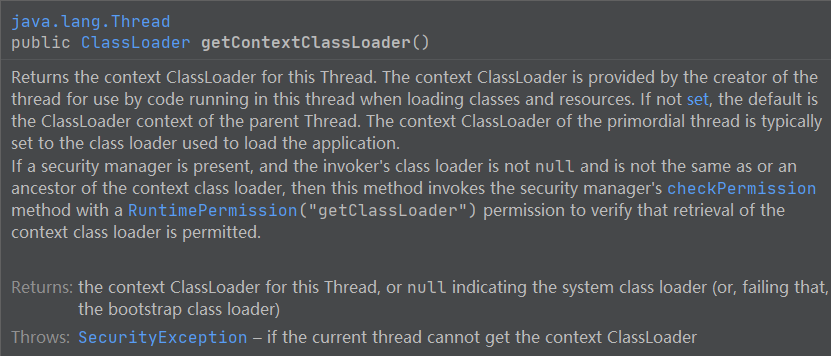
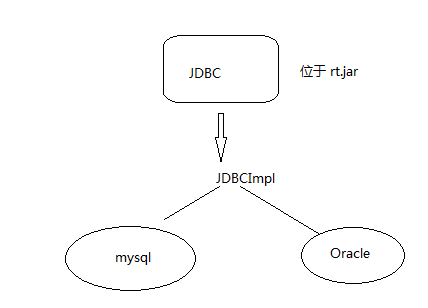
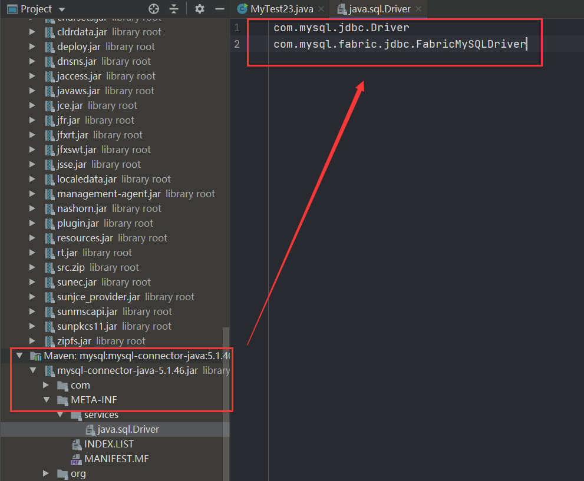
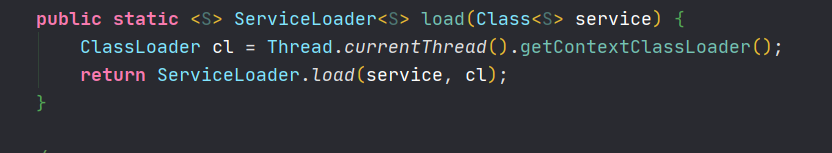
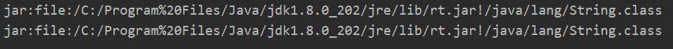
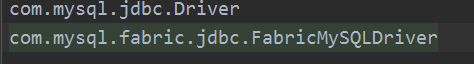
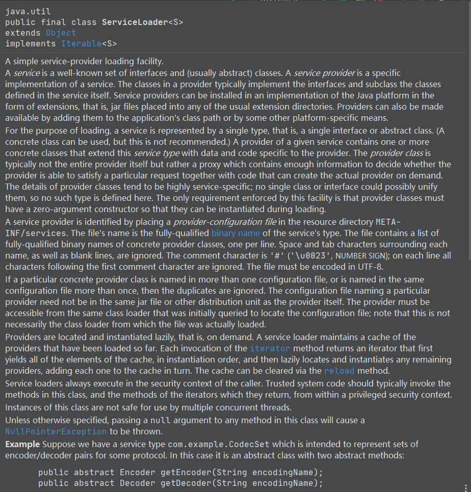
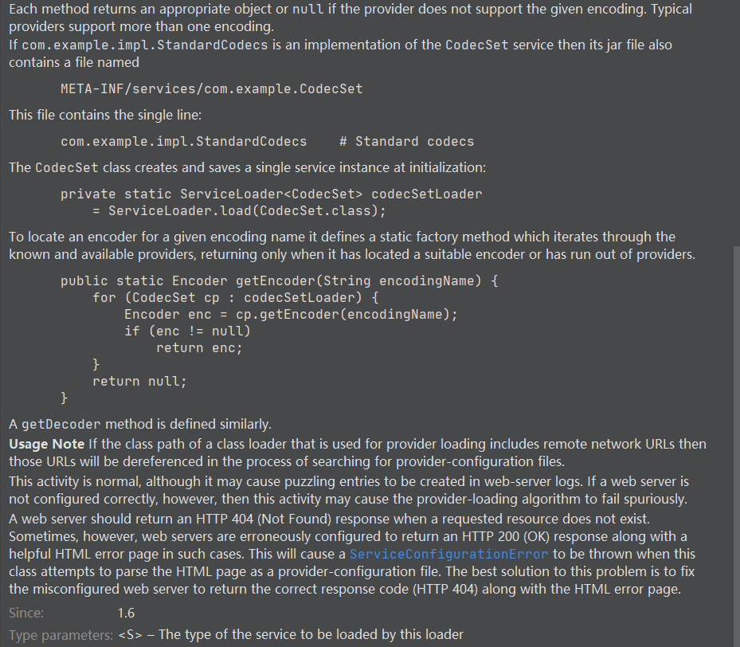

当前类加载器(Current Classloader)：

每一个类都会使用自己的类加载器（即加载自身的类加载器）去加载其他的类（指的是所依赖的类）如果Class x 引用了 Class y，那么Class x的类加载器就会去加载Class y（前提是Class y尚未被加载） 

##### 线程上下文类加载器（Context ClassLoader）：

​        线程上下文加载器是从JDK1.2开始引入的，类 Thread 中的 getContextClassLoader 与setContextClassLoader 分别用来获取和设置上下文加载器，如果没有通过 setContextClassLoader 进行设置的话，线程将会继承其父线程的 上下文类加载器。java 应用运行时的初始线程的上下文类加载器是系统类加载器（这里初始线程上下文加载器是系统类加载器在 Launcher 源码可以看到）。在线程中运行的代码可以通过该类加载器来加载类与资源。

通俗的形容：就像一个一直贯通程序执行的容器，里面装着Context ClassLoader，用就拿出来，可以换一个进去，用的时候拿出来就是另外一个。


```java
ClassLoader classLoader = Thread.currentThread().getContextClassLoader();
```

源码文档说明：




#####  线程上下文加载器的重要性： 

SPI：（Service Provider Interface）     

   	大部分的 SPI 都是自己用本身的线程上下文加载器加载，当无法加载时才会委托给父加载器，打破了传统的双亲委托模型。

​         父加载器可以使用当前线程Thread.currentThread().getContextLoader()所指定的classLoader加载的类。 这就改变了父加载不能使用子加载器或者其他没有直接父子关系的ClassLoader加载的类的情况，即改变了双亲委托模型。

​        在双亲委托模型下，类加载器是由下至上的，即下层的类会委托上层的类进行加载。但是对于spi来说，有些接口是 JAVA核心类库所提供的，而 Java核心类库是由启动类加载器来加载的，而这些接口的实现却来自于不同的jar 包（厂商提供），只会从 classpath路径加载，Java的启动类加载器是不会加载其它来源的jar包，这样传统的双亲委托模型就无法满足SPI的要求（因为接口是启动类加载器加载的，而实现类是启动类加载器加载的）， 而通过给当前线程设置上下文类加载器，就可以由设置的上下文类加载器来实现对于接口实现类的加载。

如下：

 JDBC 接口是java定义好的，不同的厂商有不同的实现。因为 JDBC 接口位于启动类加载器，故而会被启动类加载器加载，在使用到JDBC实现时，是由 启动类加载器加载的，而这些实现也会由启动类加载器尝试加载，但是这些实现类是位于 classpath 路径，是没办法被加载的。




```JAVA
import java.sql.Driver;
import java.util.Iterator;
import java.util.ServiceLoader;

/*
    线程上下文加载器的一般使用模式（获取 - 使用 - 还原）
    大部分的框架都是这种使用模式。
    ClassLoader classLoader = Thread.currentThread().getContextClassLoader();

    Try{
          // targetTccl是自己通过某种方式的得到的加载
        Thread.currentThread().setContextClassLoader(targetTccl);
        myMethod();//这个方法是使用设置的类加载器去加载
    }finally{
        //记得还原上下文类加载器，不然就直接改变了上下文类加载器
        Thread.currentThread().setContextClassLoader(classLoader);
    }

    myMethod 里面则调用了Thread.currentThread().getContextClassLoader(),获取当前线程的上下文类加载器做某些事情。
    如果一个类由类加载器A加载，那么这个类的依赖类也是由通用的类加载器加载的（如果该依赖类之前没有被加载过）
    ContextClassLoader的作用就是为了破坏Java的类加载委托机制。
    当高层提供了统一的接口让低层去实现，同时又要在高层加载（或实例化）底层的类时，就必须要通过线程上下文类加载器来帮助高层的ClassLoader找到并加载该类
* */
public class MyTest20 {
    public static void main(String[] args) {
        // 这里执行完就是创建了 ServiceLoader。
        ServiceLoader<Driver> loader = ServiceLoader.load(Driver.class);
        Iterator<java.sql.Driver> iterator = loader.iterator();

        while (iterator.hasNext()){
            Driver driver = iterator.next();
            System.out.println("driver: "+driver.getClass()+", loader: "+driver.getClass().getClassLoader());
        }
        System.out.println("当前线程上下文类加载器："+Thread.currentThread().getContextClassLoader());
        System.out.println("ServiceLoader的类加载器："+ServiceLoader.class.getClassLoader());
    }
}

```

结果：

```JAVA
driver: class com.mysql.jdbc.Driver, loader: sun.misc.Launcher$AppClassLoader@18b4aac2
driver: class com.mysql.fabric.jdbc.FabricMySQLDriver, loader: sun.misc.Launcher$AppClassLoader@18b4aac2
当前线程上下文类加载器：sun.misc.Launcher$AppClassLoader@18b4aac2
ServiceLoader的类加载器：null
```

分析：

在系统类加载器加载MyTest20 以后，会继续尝试加载 ServiceLoader 类，根据双亲委托机制，最后启动类加载器是可以加载ServiceLoader ，因为这就是java定义的规范，在load 方法执行的时候，启动类加载器是为无法加载的，所以会 获取上下文加载器去加载。（通常情况下，在没有自定义系统类加载器的时候，线程上下文加载器都是系统类加载器）


SeiviceLoader 的应用：

用于加载服务的具体实现。为什么能通过ServiceLoader.load(Driver.class)这样的 Driver.Class 就能加载实现类，原因就是ServiceLoader里面直接定义了加载的服务的路径，然后会读取这个文件每一行，这里的输出就是定义好的两个Driver。

读取 META-INF/services/完全限定名 目录下的文件，读取每一行：



具体看源文档。


当加入 Thread.currentThread().setContextClassLoader(MyTest20.class.getClassLoader().getParent());结果变为：

```JAVA
当前线程上下文类加载器：sun.misc.Launcher$ExtClassLoader@74a14482
ServiceLoader的类加载器：null
```

​       因为系统会用扩展类加载器去加载，故并不会加载到系统类加载器的内容，那就不会加载厂商提供的这些实现类。查看SeiviceLoader .load可知,SeiviceLoader 在加载一个类的时候会用当前线程的类加载器去加载;



***

##### Jar hell 问题：

* 当一个类或者一个资源文件存在于多个 jar 中，就会存在 jar hell 问题。
* 可以通过以下代码诊断问题：

```java
public class JarHell {
    public static void main(String[] args) throws IOException {
        ClassLoader classLoader = Thread.currentThread().getContextClassLoader();
        String resourceName = "java/lang/String.class";
        // 通过classL 获取资源
        Enumeration<URL> urls = classLoader.getResources(resourceName);
        // 再获取jar 包位于哪些地方
        while (urls.hasMoreElements()){
            URL url = urls.nextElement();
            System.out.println(url);
        }

    }
}

```

结果：



***


#### ServiceLoader 类源码解析：

java.util public final class ServiceLoader<S>  extends Object  implements Iterable<S>

作用就是用于加载服务的具体实现

##### 文档说明：

1、一个简单的服务提供者加载设施。

> ServiceLoader 就是针对 SPI  所提出的加载设施

2、服务就是已知的抽象类和接口的集合。服务提供者是对服务的具体实现。服务提供者通常都会实现服务本身定义的接口和继承服务本身的类。服务提供者是可以被安装到 java 平台以一种扩展的实现，比如说以 jar 文件形式放置到任何扩展目录的下面。提供者还可以变的可用通过将自身添加到应用的类路径或者一些特定于平台的方法。

> 第二句解释：其实就是实现接口和继承抽象类。
>
> 最后一句解释：就是添加到系统类加载器的类路径上以便可用被系统类加载器加载。

3、出于加载的目的，服务是一个单个的类型去表示的，也就是说一个单个的接口或者是抽象类（可以使用抽象类，但是不推荐去使用它）。给定服务的提供者会包含一个或者多个具体的类去扩展服务类型用给定的数据或者代码。提供者类通常不是全完是提供者本身而是一个代理，这个代理包含了足够的信息去确定服务提供者是否能满足特定的需求，并且加上部分代码就能够根据需要创建实际的提供者。提供者类的细节是和服务高度相关的，没有单个的类或接口能够统一它们，因此并没有定义这种类型。对于这个设施来说唯一的需求就是必须有一个无参构造方法，这样它们在加载的时候就能被实例化。


4、服务提供者是通过将服务提供者的配置文件放置在资源目录的META-INF/services 目录下去标识自身。文件的名称则是此服务类型的完全限定二进制名称。文件包含了一个具体创建的提供者类的完全限定二进制类名的列表，每个类名称一行。空格和tab键以及相应的空格行都会被忽略掉。注释字符是 # 号；在第一个注释字符后面所有的字符都会被忽略掉。这个文件必须是 UTF-8格式编码。

> 解释：就是服务提供者要以某种方式告诉 jdk 提供的类是啥
>
> 文件的名称则是此服务类型的完全限定二进制名称表名这个配置文件的名称就是实现的接口名称。
>
> 这个图就解释了这段话，配置文件就是这样的。服务提供者就是其中的一行指向的类



5、如果在多个配置文件都出现了一个具体的服务提供者类名称，或者这个类名在相同的配置文件里面出现了多次，重复的就会被忽略掉。配置文件的名称是不需要位于相同的 jar 文件或者提供者的其他分发单元里面。提供者必须是能被与最初定位配置文件的类加载器加载；注意这个类加载器对于实际被加载的类并不是必要的。

6、提供者是延迟定位和实例化的，也就是说按需求定位或者实例化。一个服务的加载器会包到目前为止的提供者的缓存。每一次对于 iterator 方法的调用都会返回一个迭代器，它首先以实例化的顺序缓存所有的元素，然后延迟定位和实例化其他的提供者，再添加到缓存里面。缓存可以通过 reload 方法被清空。

> 解释：服务提供者是需要的时候才会被加载的，而 SeiviceLoader 里面会缓存这些已经被加载后的提供者。

7、安全性说明。。。。。不必过多了解。







##### 源码分析：

示例代码（一般框架也是和下面代码使用一样的加载方式）：

```java
public class MyTest20 {
    public static void main(String[] args) {
        // z这里执行完就是创建了 ServiceLoader。
        ServiceLoader<Driver> loader = ServiceLoader.load(Driver.class);
        // 创建迭代器对象
        Iterator<java.sql.Driver> iterator = loader.iterator();

        while (iterator.hasNext()){
            Driver driver = iterator.next();
            System.out.println("driver: "+driver.getClass()+", loader: "+driver.getClass().getClassLoader());
        }
        System.out.println("当前线程上下文类加载器："+Thread.currentThread().getContextClassLoader());
        System.out.println("ServiceLoader的类加载器："+ServiceLoader.class.getClassLoader());
    }
}
```


```java
public final class ServiceLoader<S> implements Iterable<S> {
	//这里就解释类为什么是 META-INF/services 文件夹
    private static final String PREFIX = "META-INF/services/";
    // The class or interface representing the service being loaded
    private final Class<S> service;
    // The class loader used to locate, load, and instantiate providers
    private final ClassLoader loader;
    // 这里就是服务提供者的缓存。
    private LinkedHashMap<String,S> providers = new LinkedHashMap<>();
    // LazyIterator 对象
    private LazyIterator lookupIterator;
    // The access control context taken when the ServiceLoader is created
    private final AccessControlContext acc;
        
    //、、 使用当前线程的上下文加载器去创建给的服务类型、、//
    public static <S> ServiceLoader<S> load(Class<S> service) {
        // 如果这里不是线程上下文加载器， 执行 ServiceLoader<Driver> loader = ServiceLoader.load(Driver.class) 时，会由加载调用类的加载器（即启动类加载）尝试加载ServiceLoader，因为双亲委托的存在，会直接委托到启动类加载器，而启动类加载器是可以加载的，故而load方法里面的内容也是由启动类加载器加载，但是 load 的Driver 是位于classpath下面，启动类加载器加载不到。这时候，在load方法里面，把启动类加载器换为系统类加载器去加载 Driver。
        ClassLoader cl = Thread.currentThread().getContextClassLoader();
        return ServiceLoader.load(service, cl);
    }

      public static <S> ServiceLoader<S> load(Class<S> service,ClassLoader loader) {
        return new ServiceLoader<>(service, loader);
    }
    
    private ServiceLoader(Class<S> svc, ClassLoader cl) {
        service = Objects.requireNonNull(svc, "Service interface cannot be null");
        // 当前线程上下文加载没设置的话就使用 系统类加载器
        loader = (cl == null) ? ClassLoader.getSystemClassLoader() : cl;
        acc = (System.getSecurityManager() != null) ? AccessController.getContext() : null;
        //清空缓存
        reload();
    }
    
     public void reload() {
         // 清空服务提供者的缓存
        providers.clear();
        // 创建 LazyIterator 对象
        lookupIterator = new LazyIterator(service, loader);
    }
    
    // 获取迭代器对象
    public Iterator<S> iterator() {
        // 匿名内部类的方式产生 Iterator 实例
        return new Iterator<S>() {
            // 已经加载的 Providers
            Iterator<Map.Entry<String,S>> knownProviders = providers.entrySet().iterator();
	    // 判断是否有下一个
            public boolean hasNext() {
                if (knownProviders.hasNext())
                    return true;
                // 这里的 lookupIterator 就是在执行reload()所创建的 LazyIterator 对象
                return lookupIterator.hasNext();
            }
            //获取 服务提供者对象
            public S next() {
                if (knownProviders.hasNext())
                    return knownProviders.next().getValue();
                return lookupIterator.next();
            }

            public void remove() {
                throw new UnsupportedOperationException();
            }

        };
    }
    
    .
    .
    .
        
   /* 内部类 LazyIterator */
   private class LazyIterator implements Iterator<S>{
        Class<S> service;
        ClassLoader loader;
        Enumeration<URL> configs = null;
        Iterator<String> pending = null;
        String nextName = null;
       
        private LazyIterator(Class<S> service, ClassLoader loader) {
            this.service = service;
            this.loader = loader;
        }
    }
    
    
       public S next() {
            if (acc == null) {
                return nextService();
            } else {
                PrivilegedAction<S> action = new PrivilegedAction<S>() {
                    public S run() { return nextService(); }
                };
                return AccessController.doPrivileged(action, acc);
            }
        }
    
        //、、返回服务提供者、、//
        private S nextService() {
            if (!hasNextService())
                throw new NoSuchElementException();
            String cn = nextName;
            nextName = null;
            Class<?> c = null;
            try {
                // 创建 Class 对象实例。根据 hasNextService 方法设置的nextName，也就是找到的 Class 对象的完全限定名，调用forName方法，这里的 loader 就是在调用 load() 方法的时候实例化 ServiceLoader的时候设置的系统类加载器，从当前线程上下文加载器中获取的
                c = Class.forName(cn, false, loader);
            } catch (ClassNotFoundException x) {
                fail(service,"Provider " + cn + " not found");
            }
            if (!service.isAssignableFrom(c)) {
                fail(service,"Provider " + cn  + " not a subtype");
            }
            try {
                S p = service.cast(c.newInstance());
                // 把新建的服务提供者实例放入缓存里面
                providers.put(cn, p);
                return p;
            } catch (Throwable x) {
                fail(service, "Provider " + cn + " could not be instantiated",x);
            }
            throw new Error();          // This cannot happen
        }
    
        //、、判断是否有下一个服务提供者、、//
        private boolean hasNextService() {
            // 下一行不为空，说明还有下一个服务提供者
            if (nextName != null) {
                return true;
            }
            if (configs == null) {
                try {
                    // 拼接名，前缀名加Class对象名称
                    String fullName = PREFIX + service.getName();
                    // loader 为空说明使用系统类加载器
                    if (loader == null)
                        // 加载配置文件
                        configs = ClassLoader.getSystemResources(fullName);
                    else
                        configs = loader.getResources(fullName);
                } catch (IOException x) {
                    fail(service, "Error locating configuration files", x);
                }
            }
            // 解析内容，不断地判断。
            while ((pending == null) || !pending.hasNext()) {
                if (!configs.hasMoreElements()) {
                    return false;
                }
                // 读取了配置文件的内容
                pending = parse(service, configs.nextElement());
            }
            // 解析完的配置文件的每一行所写类二进制名称（返回的是读过的那一行数据，而不是下一行）
            nextName = pending.next();
            return true;
        }
        .
        .
        .

}

```

