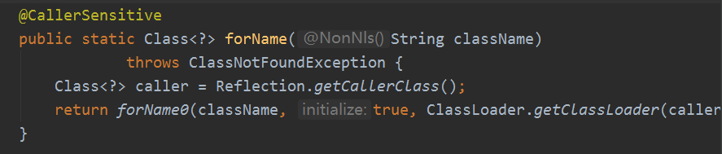
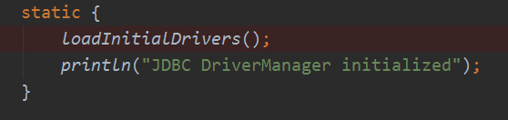

JDBC 加载分析：

```java
public class MyTest24 {
    public static void main(String[] args) throws Exception {
         Class.forName("com.mysql.jdbc.Driver");
        Connection conn = DriverManager.getConnection("","username","password");
    }
}
```

分析：

​		Class.forName("com.mysql.jdbc.Driver") 这段代码执行，会初始化 Driver，默认的 initialize 参数是 true



​		查看要加载的 Driver 类可知，它的静态代码块中存在了代码，这些代码在初始化的时候被调用。这里调用了 DriverManager 的静态方法，故而DriverManager 类又会被加载。（这里会先加载类，再调用静态方法）

```java
public class Driver extends NonRegisteringDriver implements java.sql.Driver {
    public Driver() throws SQLException {
    }

    static {
        try {
            DriverManager.registerDriver(new Driver());
        } catch (SQLException var1) {
            throw new RuntimeException("Can't register driver!");
        }
    }
}
```

查看 DriverManager 类，类中存在静态代码块，并且有调用相应的静态方法 loadInitialDrivers。



执行完 loadInitialDrivers 方法后，DriverManager 加载完成。然后执行之前的 registerDriver 方法，用DriverInfo 类包装 Driver 把 Driver 注册到 一个List列表中。

接着执行这段代码：

 Connection conn = DriverManager.getConnection("","username","password");

```java
public class DriverManager {
 
     static {
        loadInitialDrivers();
        println("JDBC DriverManager initialized");
    }
    
    private static void loadInitialDrivers() {
        String drivers;
        try {
            drivers = AccessController.doPrivileged(new PrivilegedAction<String>() {
                public String run() {
                    return System.getProperty("jdbc.drivers");
                }
            });
        } catch (Exception ex) {
            drivers = null;
        }
         AccessController.doPrivileged(new PrivilegedAction<Void>() {
            public Void run() {
		// 这里就是之前分析的，加载 Driver 类的实现的方法。
                ServiceLoader<Driver> loadedDrivers = ServiceLoader.load(Driver.class);
                Iterator<Driver> driversIterator = loadedDrivers.iterator();
                try{
                    while(driversIterator.hasNext()) {
                        driversIterator.next();
                    }
                } catch(Throwable t) {
                }
                return null;
            }
        });
        println("DriverManager.initialize: jdbc.drivers = " + drivers);
	// 系统属性为空或者没有获取到 Driver。终止程序。
        if (drivers == null || drivers.equals("")) {
            return;
        }
        String[] driversList = drivers.split(":");
        println("number of Drivers:" + driversList.length);
        for (String aDriver : driversList) {
            try {
                println("DriverManager.Initialize: loading " + aDriver);
                Class.forName(aDriver, true,
                        ClassLoader.getSystemClassLoader());
            } catch (Exception ex) {
                println("DriverManager.Initialize: load failed: " + ex);
            }
        }
    }
    
    //、、、、//
    public static Connection getConnection(String url,
        String user, String password) throws SQLException {
        java.util.Properties info = new java.util.Properties();

        if (user != null) {
            info.put("user", user);
        }
        if (password != null) {
            info.put("password", password);
        }
	// 这里的Class对象是调用 getConnecton方法的类，即MyTest24
        return (getConnection(url, info, Reflection.getCallerClass()));
    }
    
    
     private static Connection getConnection(
        String url, java.util.Properties info, Class<?> caller) throws SQLException {
	// 这里的 caller.getClassLoader() 获取到的是加载 MyTest22的Class的加载器，即系统类加载器
        ClassLoader callerCL = caller != null ? caller.getClassLoader() : null;
        synchronized(DriverManager.class) {
            if (callerCL == null) {
                callerCL = Thread.currentThread().getContextClassLoader();
            }
        }
	.
        .
        .

        for(DriverInfo aDriver : registeredDrivers) {
            // 这里 isDriverAllowed 判断这个驱动对象是否可用
            if(isDriverAllowed(aDriver.driver, callerCL)) {
                try {
                    println("    trying " + aDriver.driver.getClass().getName());
                    Connection con = aDriver.driver.connect(url, info);
                    if (con != null) {
                        // Success!
                        println("getConnection returning " + aDriver.driver.getClass().getName());
                        return (con);
                    }
                } catch (SQLException ex) {
                    if (reason == null) {
                        reason = ex;
                    }
                }
            } else {
                println("    skipping: " + aDriver.getClass().getName());
            }
        }
        .
        .
        .
            
    }
    
    
     private static boolean isDriverAllowed(Driver driver, ClassLoader classLoader) {
        boolean result = false;
        if(driver != null) {
            Class<?> aClass = null;
            try {
                aClass =  Class.forName(driver.getClass().getName(), true, classLoader);
            } catch (Exception ex) {
                result = false;
            }
             // 判断这个类的Class 对象是否是由同一个类加载器去加载的。因为不是同一个类加载器加载的即使名称一致也这两个类也不一样
             result = ( aClass == driver.getClass() ) ? true : false;
        }
        return result;
    }
    
}
```


