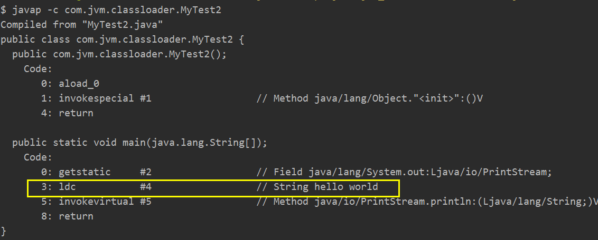

final 修饰的变量会进入常量池，:

```JAVA
package com.jvmm.classloader;

/*
   常量在编译阶段会存入到调用这个常量的方法所在类的常量池中，本质上，调用类并没有
直接引用到定义常量的类，因此并不会触发定义常量的类的初始化
注意：这里指的是将常量存放到了MyTest2的常量池中，之后MyTest2与MyParent2就没有任何关系了。
甚至我们可以将MyParent2的class文件删除（指的是编译完后，不是不写这个类)
*/

/*
    助记符：
    ldc 表示将int，float 或者是 String类型的常量值从常量池中推送至栈顶
    bipush 表示将单字节的常量值推送至栈顶
    sipush 表示将一个短整型常量值推送至栈顶
    iconst_1 表示将int类型的1推送至栈顶 （iconst_1 ~ iconst_5，jvm至给了5个，6开始就变为bipush）
*/
public class MyTest2{
    public static void main(String[] args) {
        System.out.print(MyParent2.str);
    }
}

class MyParent2 {
    
    public static final String str = "hello world";
    //public static final short s = 127;
    //public static final int i = 128;
    //public static final int m =6;
    static {
        System.out.print("MyParent2 static block");
    }
}

```

结果：

```JAVA
hello world
```

原因：

​        这里常量在编译阶段就确定了，因此常量在编译阶段`会存入到调用这个常量的方法所在类的常量池中`，本质上，调用类并没有直接引用到定义常量的类，因此并不会触发定义常量的类的初始化。（甚至如果没有其他地方用到，都不会去加载）

通过反编译可以证明(javap -c)，这个静态变量是MyTest2的常量（反编译的是编译完以后的文件）：




甚至连 MyParent2 这个类都没有加载


补充:助记符在 jdk 的 rt.jar 包里面


助记符本质上是最底层的一些类的进行操作的：


***

代码示例 3：

```java
package com.jvm.classloader;

import java.util.UUID;
/*
    当一个常量的值并非编译期可以确定的，那么其值就不会被放到调用类的常量池中，
    这时在程序运行时，会导致主动使用这个常量所在的类，显然会导致这个类被初始化。
*/
public class MyTest3 {
    public static void main(String[] args) {
        System.out.print(MyParent3.str);
    }
}

class MyParent3{

    public static final String str = UUID.randomUUID().toString();

    static {
        System.out.print("MyParent3 static code");
    }
}
```

结果：

```java
MyParent3 static code
64e908d7-5c25-4376-996e-717017163295
```

​       和例二的区别在于，同样是常量，但是这里的常量在编译期是不能够确定的，因此必须是依赖 MyParent3这个类，而不是直接放入调用类的常量池，因为无法确定值。


***

代码示例 4：

```java
package com.jvm.classloader;
/*
  对于数组实例来说，其类型是由JVM在运行期动态生成的，表示为 
  class [Lcom.jvm.classloader.MyParent4
  这种形式。由jvm动态生成的类型，其父类就是 Object.
  
  对于数组来说，JavaDoc 经常将构成数组的元素为Component，实际就是将数组降低一个维度后的类型
  
  助记符：
  anewarray：表示创建一个引用类型的（如类，接口，数组）数组，并将其引用值压入栈顶。
  newarray：表示创建一个指定的原始类型，（如int，float，char）的数组，并将其引用值压入栈顶
* */

public class MyTest4 {
    public static void main(String[] args) {
//        MyParent4 myParent4 = new MyParent4();

        //静态代码块在初始化的时候执行，而初始化只会在类的首次主动使用时才会，故而只会执行一次
//        System.out.println("---------------");
//        MyParent4 myParent41 = new MyParent4();

        MyParent4[] myParent4s = new MyParent4[1];
        System.out.println(myParent4s.getClass());//输出类型

        MyParent4[][] myParent4s1 = new MyParent4[1][1];
        System.out.println(myParent4s1.getClass());

        // 证明数组的父类都是 Object
        System.out.println(myParent4s.getClass().getSuperclass());
        System.out.println(myParent4s1.getClass().getSuperclass());

        System.out.println("=============下面是原生类型==============");

        int[] ints = new int[1];
        System.out.println(ints.getClass());
        System.out.println(ints.getClass().getSuperclass());
        
        boolean[] booleans = new boolean[1];
        System.out.println(booleans.getClass());

        short[] shorts = new short[1];
        System.out.println(shorts.getClass());
    }
}

class MyParent4{
    static {
        System.out.println("MyParent4 static block");
    }
}
```

结果：

```java
class [Lcom.jvm.classloader.MyParent4;  // 半个 [ 代表的是一维数组 ，[ 类型后面的是类型。两个 [[ 代表的是二维数组
class [[Lcom.jvm.classloader.MyParent4;
class java.lang.Object
class java.lang.Object
=============下面是原生类型==============
class [I
class java.lang.Object
class [Z    //注意 bolean 类型是 z
class [S
```

原因：

​         数组类型的class对象，并不是由类加载器加载器的，是java虚拟机在运行期的时候帮我们自动创建的。用数组对象调用getClassLoader和数组里面任意元素调用getClassLoader返回的结果是一样的（详见 ClassLoader）

***

代码示例 5：

```java
package com.jvm.classloader;
/*
    当一个接口在初始化时，并不要求其父类接口都完成了初始化
    只有在真正使用到父接口的时候（如引用接口中所定义的常量时），才会初始化
* */
public class MyTest5 {
    public static void main(String[] args) {
        System.out.println(MyChild5.b);
        //System.out.println(MyChild5_02.thread);
    }
}

//验证初始化类的时候并不会先初始化它实现的接口
interface MyParent5{
    public static Thread thread = new Thread(){
        {
            System.out.println("MyParent5 invoked");
        }
    };
}

class MyChild5 implements MyParent5{
    public static int b = 6;
}

//验证在初始化一个接口时，并不会先初始化它的父接口
interface MyParent5_02 {
    public static Thread thread = new Thread(){
        {
            System.out.println("MyParent5_02 invoked");
        }
    };
}

interface MyChild5_02 extends MyParent5_02{
    public static Thread thread = new Thread(){
        {
            System.out.println("MyChild5_02 invoked");
        }
    };
}
```

​         对于接口来说，在定义的时候即使不加 final，默认也是 final，因此加 static 的字段会就变为常量，直接进入调用类的常量池。但是这里的常量如果在编译器不能够确定，则无法进入 MyTest5 常量池。并且接口是不要求父接口被初始化的。

* 在初始化一个类时，并不会先初始化它实现的接口
* 在初始化一个接口时，并不会先初始化它的父接口

只有在真正使用到父接口的时候（如引用接口中所定义的常量时），才会初始化。类在初始化的时候，会先初始化父类，如果父类还有父类，则会继续初始化父类的父类，直到初始化完

只有当前程序访问的静态变量或静态方法确实是在当前类或当前接口中定义时，才可以认为是对类或接口的主动使用。例子在MyTest11。