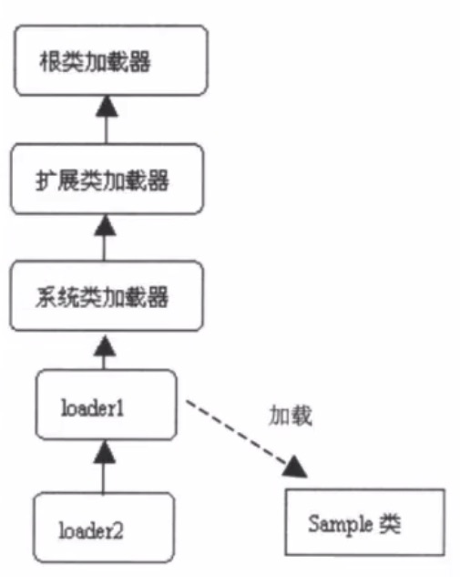
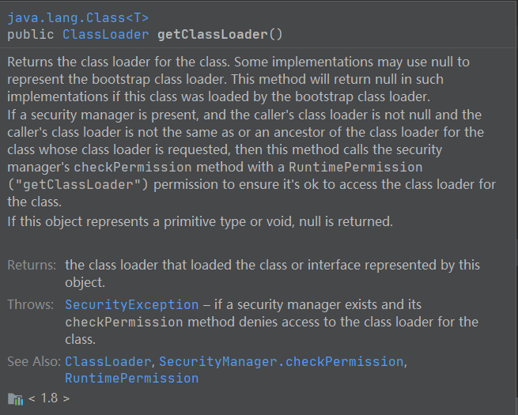

		在父亲委托机制中，各个加载器按照父子关系形成了树形结构，除了根类加载器之外，其余的类加载器有且只有一个父类加载器。


##### 类加载器的双亲委托模型的好处：

1.可以确保 Java核心库的类型安全，所有的Java应用都至少会引用java.lang.Object类，也就是说在运行期，java.lang.Object这个类会被加载到Java虚拟机中；如果这个加载过程是由Java应用自己的类所完成的，那么很可能就会在 Jvm 中存在多个版本的 java.lang.Object 类，而且这些类之间还是不 兼容的，相互不可见的（命名空间的作用）。  借助于双亲委托机制，Java核心类库中的类的加载工作都是由启动类加载器来统一完成，从而确保了java应用使用的都是同一个版本的Java核心类库，他们之间是相互兼容的。

2.可以确保 Java 核心类库所提供的类不会被自定义的类所代替。

3.不同的类加载器可以为相同名称(二进制名称）的类创建额外的命名空间。相同名称的类可以并存于Java虚拟机中，只需要用不同的类加载器来加载他们即可。不同的类加载器所加载的类之间是不可兼容的。这就相当在Java虚拟机  内部创建了一个又一个相互隔离的Java类空间，这类技术在很多框架中都得到了实际应用。




！！！这里不是继承关系，是包含关系 ！！！。

这里loader1 和loader2 是自定义的，sample 是要加载的类 。

 	   通过 loader1 加载 sample类，会先把加载任务转交给父加载器，即系统类加载器，系统类加载器又会继续向上转交任务，直到根类加载器，没有了父类加载器，就会尝试加载 sample 类。但是根类加载器是不能加载sample 类的，故又把任务返回给子类。     

***

​		若有一个类加载器能够成功加载 sample 类，那么这个类加载器就被称为 ==定义类加载器==，所有能成功返回Class对象引用的类加载器（包括定义类加载器）都被称为 初始类加载器。

​		上例，系统类最终能成功加载sample类，则系统类加载器称为 定义类加载器，loader1，系统类加载器都称为==初始类加载器==。

***


代码示例：

```JAVA
package com.jvm.classloader;

//类加载器的测试
public class MyTest7 {
    public static void main(String[] args) throws ClassNotFoundException {
        //返回 null 是因为这算是由bootstrap类加载器加载的
        Class<?> clazz = Class.forName("java.lang.String");
        System.out.println(clazz.getClassLoader());

        Class<?> clazz2 = Class.forName("com.jvm.classloader.c");
        System.out.println(clazz2.getClassLoader());
    }
}

class c{

}
```

结果：

```JAVA
null
sun.misc.Launcher$AppClassLoader@18b4aac2
```


getClassLoader 源码说明：




重要的几点就是：系统类加载器，原生类型或空 会返回 null

****


##### 数组类加载：

> ​    数组类型的class对象，并不是由类加载器加载器的，是java虚拟机在运行期的时候帮我们自动创建的。用数组对象调用getClassLoader和数组里面任意元素调用getClassLoader返回的结果是一样的。
>

代码示例：

```JAVA
package com.jvm.classloader;

//对于类加载器的解释说明
public class MyTest13 {
    public static void main(String[] args) {
        String[] strings = new String[]{};
        System.out.println(strings.getClass().getClassLoader());

        System.out.println("---------------------");

        MyTest13[] myTest13 = new MyTest13[]{};
        System.out.println(myTest13.getClass().getClassLoader());

        System.out.println("---------------------");

        int[] ints = new int[]{};
        System.out.println(ints.getClass().getClassLoader());
    }
}
```

结果:

```JAVA
null
---------------------
sun.misc.Launcher$AppClassLoader@18b4aac2
---------------------
null
```

分析：

第一个null 是因为在jvm中，string类型是由 bootstrop加载的。第二个是我们自定义的类型，一般都是 AppClassLoader 加载的，而第三个 null 和第一个不一样，对于原生类型（八大基本类型)，是没有类加载器的。