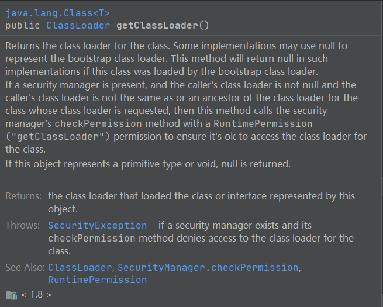

#### classloader 类：

##### 源码文档：

1、类加载器是加载类的对象，并且类加载器本身是抽象类。在给定一个类的二进制名称时，类加载器应该能定位这个类或者生成构成这个类定义的数据。典型的做法是将给的二进制名称转换为文件名，然后从文件系统中读取和文件名一致的二进制文件。

> 第一句解释：二进制名称下面有定义。
>
> 第二句解释：定位是说这个类的数据已经真正的存在于某个地方，而类加载器能找到这个地方。
>
> 第三局解释：生成是说有些类是在运行期动态生成的，比如说动态代理，
>
> 第三局解释：和我们日常开发是一样的，表示是从磁盘上（也就是文件系统中）去读取二进制名称所对应的 class 信息。当然也可以从网络上获取字节码文件。


2、每一个Class对象都包含了定义它的classloader的引用。

> 这里解释了为什么Class这个类有getClassLoader这个方法，故而每一个类的Class类都会有这个方法。注意，一个类的 .class 和实例对象的 getClass 方法获取的都是 Class 对象。

```JAVA
 MyParent1 my = new MyChild1();
System.out.println( my.getClass().getClassLoader()）;
System.out.println(MyParent1.class.getClassLoader());
```


3、对于数组类的Class对象，并不是由类加载器创建的，而是由java运行时在需要的时候自动创建。对于数组类的类加载器来说，其通过getClassLoader方法返回的类加载器和数组元素类型返回的类加载器相同；如果元素类型是原生类型，则数组类并没有类加载。

> 第一句解释：除了数组类的Class对象，其他类的Class对象一定是由类加载创建的，类加载器从磁盘上加载字节码文件，然后把Class对象创建出来。而数组的类型在详见 MyTest4。
>
> 第二句解释：详见 MyTest15,数组返回的类加载器就是数组元素返回的类加载器。
>
> 第三句解释：详见 MyTest15，原生类型指的是八大类型，是没有类加载器的，getClassLoader返回的是null。注意和启动类加载器返回的null 性质是不一样的。


4、应用实现了ClassLoader类的子类是为了扩展java虚拟机动态加载类的方式。

> 这句话就说明了自定义类加载器的用途，继承了ClassLoader类形成子类，就可以扩展类加载器，形成自己的加载方式。


5、类加载器典型情况下是可以被安全管理器所使用去表示安全域问题。

> 确保类加载的过程一定是安全的。（安全管理器，安全域不知道是啥）


6、ClassLoader使用双亲委托模型去寻找类和资源。ClassLoader的每一个实例都有一个与之关联的父类ClassLoader。当ClassLoader寻找类或者资源的时候，ClassLoader的实例会把寻找类或者资源的任务委托给父类，在它自己去尝试寻找类或者资源之前。虚拟机内建的类加载器，称之为启动类加载器，它本身是没有双亲的，但是它可以作为其他类加载器的双亲。

> 第一句解释：类加载器使用的是双亲委托模型。
>
> 第二局解释：每一个类加载器都有一个父类加载器


7、不会，略过。


8、通常情况下，java虚拟机是从与平台相关的文件系统中加载类。举个例子，在UNIX系统上，虚拟机会从CLASSPATH环境变量所定义的路径上去加载类。

> 意思就是在不同的从操作系统里面，虚拟机加载类有所不同。


9、然而，一些类并不是来自于文件；它们可能来自其他地方，比如网上，或者由应用本身创建的。在这种情况下，defineClass方法就会把字节数组转换为Class类的实例。而这个新定义的类实例是可以通过Class.newInstance方法创建。

> 第一句解释：应用本身创建的例子就是动态代理，它的类就是运行时产生的。
>
> 第二三句解释：这里分为两个步骤，第一步是通过defineClass方法把字节数组转换为Class类对象，这个Class类对象指的就是存在于虚拟机中的Class而不是通过Class创建的实例，而要想创建Class所对应的真正实例，要通过Class.newInstance方法创建,而调用的 Class.newInstance 底层会默认调用要实例化的类的无参构造，若是没有指定有参构造的话。


10、由类加载器创建的对象的方法和构造方法还可能引用其他的类。为了确定被引用的类都是什么，java虚拟机会调用 loadClass 方法去加载这个类所引用的其他的类。

> 这里注意，调用ClassLoader 的loadClass 方法不是对类的主动使用，因此并不会初始化这个类。


****


#### ClassLoader 类方法说明：

##### getSystemClassLoader（） 方法文档说明：

1、返回用于委托的系统类加载器。它是新的ClassLoader实例的默认委托双亲，并且通常也是用于启动应用的类加载器。

> 解释：像包含 main 方法的类都会由系统类加载器加载


2、这个方法在运行启动过程中的很早期就会被调用，在此方法被调用的这个时刻会创建系统类加载器而且它会将这个系统类加载器设置为调用本方法的线程的上下文加载器。

> 解释：getSystemClassLoader 不仅会返回系统类加载器，并且在最开始调用此方法也会创建系统类加载器。


3、默认的系统类加载器是一个与这个类实现相关实现的一个实例。


4、在 getSystemLoader 这个方法第一次被调用的时候，如果系统属性 java.system.class.loader 被定义了，那么这个属性的值就会被作为系统类加载器的相应的名称。这个类（就是我们定义的属性值指向的自定义的那个classloader类）会被系统类加载并且这个类必须定义一个公有的构造器能够接受单个的 ClassLoader类型的参数用作委托双亲。这个构造方法会使用默认的系统类加载器作为父类加载器在创建自定义的类加载器实例的时候。

> 解释：这里的这个类会被系统类加载器加载的意思是，自定义的这个类会成为系统类加载器，调用getSystemLoader方法返回的就是自定义类加载器，但是当自定义类加载器的实例调用getClassLoader方法的时候，返回的是 AppClassLoader。
>
> 最后一句解释:自定义的系统类加载器会使用 JDK 自带的系统类加载器作为父类，虽然此时getSystemLoader 方法返回的已经不是  JDK 自带的系统类加载器，而是自定义的系统类加载器。因为已经通过 java.system.class.loader 参数更改了系统类加载器。

源码文档：


##### getSystemClassLoader (）  源代码分析：

```java
 public abstract class ClassLoader {
      // The class loader for the system
    private static ClassLoader scl;   // 系统类加载器

    // Set to true once the system class loader has been set
    private static boolean sclSet;  // 系统类加载器是否被设置

     .........
         
    public static ClassLoader getSystemClassLoader() {
        initSystemClassLoader();
        if (scl == null) {
            return null;
        }
         // 安全验证
        SecurityManager sm = System.getSecurityManager();
        if (sm != null) {
            checkClassLoaderPermission(scl, Reflection.getCallerClass());
        }
        return scl;
    }

    // 、、初始化加载器的方法、、//
    private static synchronized void initSystemClassLoader() {
        //如果系统类加载器没有被设置
        if (!sclSet) {
            // 系统类加载器不为空
            if (scl != null)
                 // 抛出递归调用异常。原因是系统类没被设置肯定为空
                throw new IllegalStateException("recursive invocation");
            // 获取系统类加载器和扩展类加载器的外层类对象。（系统类加载器和扩展类加载器都是Launcher类的内部类,下面是针对 Launcher类的分析）
            sun.misc.Launcher l = sun.misc.Launcher.getLauncher();
            if (l != null) {
                Throwable oops = null;
                // 分析Launcher得知这里返回的是 应用类加载器
                scl = l.getClassLoader();
                try {
                    // new SystemClassLoaderAction 就是为了处理开发者自定义的系统加载器。这里的scl可能是自定义的系统类加载器也可能是系统类加载
                    scl = AccessController.doPrivileged(new SystemClassLoaderAction(scl));
                } catch (PrivilegedActionException pae) {
                    oops = pae.getCause();
                    if (oops instanceof InvocationTargetException) {
                        oops = oops.getCause();
                    }
                }
                if (oops != null) {
                    if (oops instanceof Error) {
                        throw (Error) oops;
                    } else {
                        // wrap the exception
                        throw new Error(oops);
                    }
                }
            }
            // 系统类加载器设置成功
            sclSet = true;
        }
    }
            
}

	.
        .
        .
        
//、、 这个是存在于 ClassLoader 这个类文件里面的一个类、、//
class SystemClassLoaderAction implements PrivilegedExceptionAction<ClassLoader> {
    private ClassLoader parent;

    SystemClassLoaderAction(ClassLoader parent) {
        this.parent = parent;
    }
    
    // 实现了 PrivilegedExceptionAction 的run方法，以便在权限检查完后调用此 run 方法。
    public ClassLoader run() throws Exception {
        // 自定义系统类加载器的系统属性
        String cls = System.getProperty("java.system.class.loader");
        // 为空表示没有自定义系统类加载器，直接返回创建的  scl 系统类加载器。
        if (cls == null) {
            return parent;
        }
        // new Class<?>[] { ClassLoader.class } 匿名内部类会调用接受一个ClassLoader类型参数的构造方法。这里就解释了为什么自定义的系统类ClassLoader 需要添加接受一个ClassLoader类型参数的构造方法
        // 这里要用 指定的parent类加载器加载的是 cls（也就验证了我们自定义的系统类加载器的父类加载器是系统生成的系统类加载器），加载完后初始化，
        Constructor<?> ctor = Class.forName(cls, true, parent)
            .getDeclaredConstructor(new Class<?>[] { ClassLoader.class });
        // 生成新的类加载器实例。这里是把之前系统生成的系统类加载器作为我们自定义的系统类加载器的父类加载器
        ClassLoader sys = (ClassLoader) ctor.newInstance(
            new Object[] { parent });
        // 把新生成的类加载器作为当前线程上下文加载器。
        Thread.currentThread().setContextClassLoader(sys);
        return sys;
    }
}
```

补充说明 newInstance，一般获取的 Class对象用 newInstance 是调用的无参构造，而通过getDeclaredConstructor（参数的Class对象）方法获取到构造器，再通过构造器对象调用 newInstance(参数的Class对象)  就可以调用有参构造。比如 A 类的有参构造 public A(String str,int a)，那么获取其实例对象的写法就是

```java
Class[] classes = new Class[]{String.class , int.class}
A.class.getDeclaredConstructor(classes).newInstance("hello",10)
```

****

#### getResources()

###### 代码示例：

```java
// 资源文件路径
 String resourceName = "com/jvm/classloader/MyTest13.class";
 Enumeration<URL> urls = classLoader.getResources(resourceName);
```

###### 源码文档：


重要的几点就是：系统类加载器，原生类型或空 会返回 null

***

#### getClassLoader()

######  源码文档：



****

#### defineClass()

源码：


源码文档：


这个 byte[] 里面的内容必须是符合jvm虚拟机规范的字节码内容，如果不符合规定，则就一定会报错。这个 off,len 的作用，其实就是开始位置，和长度，这样就可以在开头和结尾去定义一些和字节码文件本身相关的一些其他信息，而不是执行的字节码。

****

#### findClass()

源码：


源码文档：


这个类仅仅是抛出异常，它是作为自定义类加载器必须要重写的方法，用于调用 defineClass 生成Class 对象，让 loadClass 方法调用。


***


