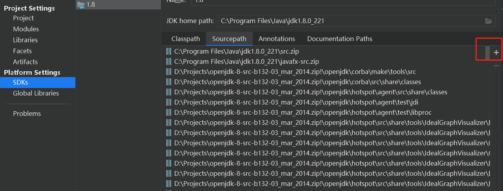

查看源码教程：



打开 SDKS，添加 Sourcepath，选择添加，选择 openJdk 的压缩包即可。


****


```java
public class Launcher {
    private static Launcher launcher = new Launcher();
    // Launcher类定义类 启动类加载器的系统属性
     private static String bootClassPath = System.getProperty("sun.boot.class.path");
    // 这里将应用类加载作为成员变量存放的。没有将扩展类加载器也作为成员变量是因为可以通过获取系统类加载器的父加载器就是扩展类加载器 //
    private ClassLoader loader;
    ...........
        
   // 这个方法实质上返回的是系统类加载器
   public ClassLoader getClassLoader() {
        return this.loader;
    }
    
    
   public static Launcher getLauncher() {
        return launcher;
     }

    public Launcher() {
        // 创建扩展类加载器
        ExtClassLoader extcl;
        try {
            // 调用 getExtClassLoader 方法产生 ExtClassLoader 实例
            extcl = ExtClassLoader.getExtClassLoader();
        } catch (IOException e) {
            throw new InternalError("Could not create extension class loader", e);
        }

        try {
            // 调用 getAppClassLoader 创建系统类加载器加载应用。这里传入了刚创建的扩展类加载器对象
            loader = AppClassLoader.getAppClassLoader(extcl);
        } catch (IOException var9) {
            throw new InternalError("Could not create application class loader", var9);
        }
	// 默认把系统产生的系统类加载器作为当前线程shangxiw
        Thread.currentThread().setContextClassLoader(loader);
        //下面部分是安全管理器的内容，，不过多了解
        String s = System.getProperty("java.security.manager");
        if (s != null) {
            SecurityManager sm = null;
            if (!"".equals(s) && !"default".equals(s)) {
                try {
                    sm = (SecurityManager)this.loader.loadClass(s).newInstance();
                } catch (IllegalAccessException e) {
                } catch (InstantiationException e) {
                } catch (ClassNotFoundException e) {
                } catch (ClassCastException e) {
                }
            } else {
                sm = new SecurityManager();
            }
            if (sm == null) {
                throw new InternalError("Could not create SecurityManager: " + s);
            }
            System.setSecurityManager(sm);
        }
    }
    
    .
    .
    .
        
      /*       扩展类加载器是 Launcher 的内部类    */   
      static class ExtClassLoader extends URLClassLoader {
          private static volatile ExtClassLoader instance;
             // 、、这个方法是创建一个 ExtClassLoader。被创建好的 ExtClassLoader 会被限定在哪个目录下读取相关的class文件。。这里其实就是双重检查的单例模式，创建 ExtClassLoader 实例、、//
           public static ExtClassLoader getExtClassLoader() throws IOException {
             if (instance == null) {
              Class var0 = ExtClassLoader.class;
              synchronized(ExtClassLoader.class) {
                  if (instance == null) {
                      // 调用 createExtClassLoader 方法产生ExtClassLoader 实例
                      instance = createExtClassLoader();
                  }
              }
           }
          return instance;
        }
          
          //、、真正创建 ExtClassLoader 的方法、、//
          private static ExtClassLoader createExtClassLoader() throws IOException {
            try {
                //用匿名内部类。run 方法会在AccessController权限检查完后被doPrivileged方法调用，自己   重写 run 方法
                return (ExtClassLoader)AccessController.doPrivileged(new PrivilegedExceptionAction<ExtClassLoader>() {
                    // 这是内部类中主要的的run方法。
                    public ExtClassLoader run() throws IOException {
                        // 调用 getExtDirs 方法获取文件对象
                        File[] dirs = getExtDirs();
                        int len = dirs.length;
                        for(int i = 0; i < len; ++i) {
                            // 这里应该是读取相应文件路径内的文件
                            MetaIndex.registerDirectory(dirs[i]);
                        }
                        // 创建 ExtClassLoader 对象
                        return new ExtClassLoader(dirs);
                    }
                });
             } catch (PrivilegedActionException e) {
                throw (IOException) e.getException();
             }
          }
            
            //、、此方法返回每一个扩展类加载器所需加载的文件对象、、//
          private static File[] getExtDirs() {
               // 获取系统属性 java.ext.dirs.其实就是扩展类加载器加载文件的路径
              String s = System.getProperty("java.ext.dirs");
              // 这个属性可能会被多个冒号分隔，故这个定义的是文件数组，因为可能会有很多文件要加载
              File[] dirs;
              if (s != null) {
                  // 用 pathSeparator 分隔这个路径属性
                  StringTokenizer st = new StringTokenizer(s, File.pathSeparator);
                  // 获取总共分隔出的路径的数量
                  int count = st.countTokens();
                  // 用分隔出的路径的数量作为创建文件数组的长度。譬如长度为5则表示dirs由五个路径构成
                  dirs = new File[count];
                  for(int i = 0; i < count; ++i) {
                      // 创建五个路径的文件对象分别赋值给 dirs 对象
                      dirs[i] = new File(st.nextToken());
                  }
               } else {
                  // 没有扩展类加载的路径属性，则直接定义长度为0的数组，表示不去加载相应的文件。
                  dirs = new File[0];
              }
              return dirs;
           }
               
        }
    	
    .
    .
    .
    
    /*    系统类加载器    */
    static class AppClassLoader extends URLClassLoader {
        
        //、、创建一个系统类加载器、、//
        public static ClassLoader getAppClassLoader(final ClassLoader excl) throws IOException {
            // 获取系统属性 java.class.path.其实就是系统类加载器加载文件的路径
            final String s = System.getProperty("java.class.path");
            // 和 ExtClassLoader 获取文件对象方法一样。
            final File[] path = s == null ? new File[0] : Launcher.getClassPath(s);
            return (ClassLoader)AccessController.doPrivileged(new PrivilegedAction<AppClassLoader>() {
                public AppClassLoader run() {
                    URL[] urls = s == null ? new URL[0] : Launcher.pathToURLs(path);
                    // 第二个参数就是指定系统类加载器的父加载器
                    return new AppClassLoader(urls, excl);
                }
            });
        }
        
        //、、这里new的 AppClassLoader、、//
        AppClassLoader(URL[] urls, ClassLoader parent) {
            // 把扩展类加载器作为父类加载器
            super(urls, parent, Launcher.factory);
            ucp.initLookupCache(this);
        }
        
    }
}
```

由源码可知：扩展类加载器和系统里加载器都是 Launcher 类的内部类