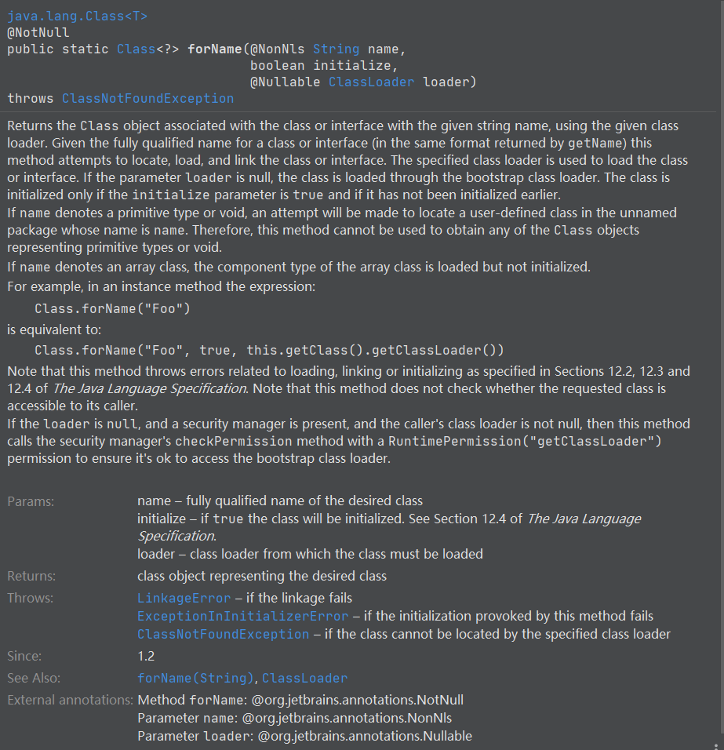

源码文档：



1、用给定的类加载器返回和给定类或者接口名称相关联的 Class 对象。给定一个类或者接口完整限定名的话（通过getName格式给出名称），这个方法就会尝试定位，加载并且连接这个类或接口。这个给定的类加载器就是用于加载这个类或者接口。如果这个类加载器的参数为 null，那么这个类就会通过启动类加载器加载。这个类会在 initialize 参数为 true 并且在它自己尚未被初始化的时候才会被初始化。

> 第一句解释：每一个Class对象都会有一个 ClassLoader对象。


2、如果 name 是一个原生类型或者空，此方法就会尝试去寻找用户定义在默认的包里面的这个类。因此，此方法是不能用于获取原始类型的或者空的 Class 对象。


3、如果名称是数组类型，则会加载 组件属性的类但是不会被初始化。

> 这里的组件属性其实就是类加载器对于数组的处理方式，


##### forName方法源码：

```java
public final class Class<T> implements java.io.Serializable,GenericDeclaration,Type, AnnotatedElement {
    ..........
    
   public static Class<?> forName(String name, boolean initialize,
                                   ClassLoader loader)
        throws ClassNotFoundException
    {
        Class<?> caller = null;
        SecurityManager sm = System.getSecurityManager();
        if (sm != null) {
            // getCallerClass 是native 方法，返回调用 getCallerClass 的方法调用者的类
            // 也就是返回的是 调用 forname 放在所在的那个类的 Class对象。
            caller = Reflection.getCallerClass();
            if (sun.misc.VM.isSystemDomainLoader(loader)) {
                // 获取到调用 forname 那个类的 Class 对象的类加载器。至于本来就是父类加载器加载
                ClassLoader ccl = ClassLoader.getClassLoader(caller);
                // 安全性检测
                if (!sun.misc.VM.isSystemDomainLoader(ccl)) {
                    sm.checkPermission(
                        SecurityConstants.GET_CLASSLOADER_PERMISSION);
                }
            }
        }
        return forName0(name, initialize, loader, caller);
    }
    
    .
    .
    .
        
}
```


##### 补充：

Reflection.getCallerClass()  默认参数为 2。

0和小于0 -返回 Reflection类

1  返回自己的类

2 返回调用者的类

3，4 层层上传

在 idea 这段代码并不能执行，会报错。

```java
package com.jvm.classloader;

import sun.reflect.Reflection;

/**
 * @program: test_jvm
 * @description:
 * @author: you.Wang
 * @create: 2020-02-11 00:35
 **/
public class MyTestReflection {
    public static void main(String[] args) {
        Test t = new Test();
        t.method01(); 
    }
}

class Test{
    public void method01(){
        method02();
    }

    private void method02() {
        System.out.println("-1 :"+ Reflection.getCallerClass(-1));
        System.out.println(" 0 :"+ Reflection.getCallerClass(0));
        System.out.println(" 1 :"+ Reflection.getCallerClass(1));
        System.out.println(" 2 :"+ Reflection.getCallerClass(2));
        System.out.println(" 3 :"+ Reflection.getCallerClass(3));
        System.out.println(" 4 :"+ Reflection.getCallerClass(4));
        System.out.println(" 5 :"+ Reflection.getCallerClass(5));
        
        
    }
}

```

结果：

```java
-1 ： class sun.reflect.Reflection
0 ： class sun.reflect.Reflection
1 : com.jvm.classloader.Test
2 ： com.jvm.classloader.Test
3 ：com.jvm.classloader.TestMyRelection
4：null
5：null
```


