CMS （Concurrent Mark Sweep）收集器，以获取最短回收停顿时间为目标，多数应用于互联网站或者B/S 系统的服务器端上。

CMS 是基于 “标记-清除” 算法实现的，整个过程分为4个过程：

* 初始标记（CMS initial mark）
* 并发标记（CMS concurrent mark）
* 重新标记（CMS remark）
* 并发清除（CMS concurrent sweep）

并发的含义表示的是用户的线程和业务的线程会同时的执行。


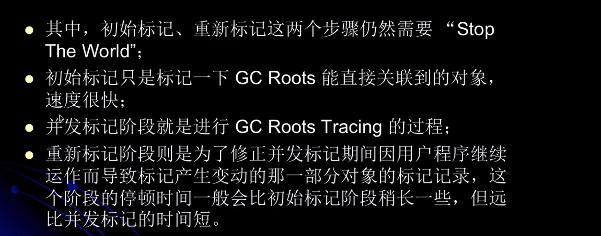

GC Rooting Tracing 从GC root 开始找到被 GC Root 引用或者关联的对象，再从被引用或者关联的对象这个对象出发，再去找它自己能引用或者关联的对象。

并发标记这个阶段是和用户线程同时发生的，可能某个对象之前没被引用，现在被引用了，就需要重新标记。


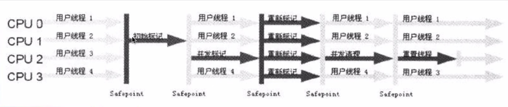

这里就能看到，在初始标记的阶段，是没有用户线程执行的。而在重新标记阶段，也没有用户线程，但是这阶段是并发的。


##### CMS优点：

并发、低停顿。（停顿指的是停顿用户线程）

##### 缺点：

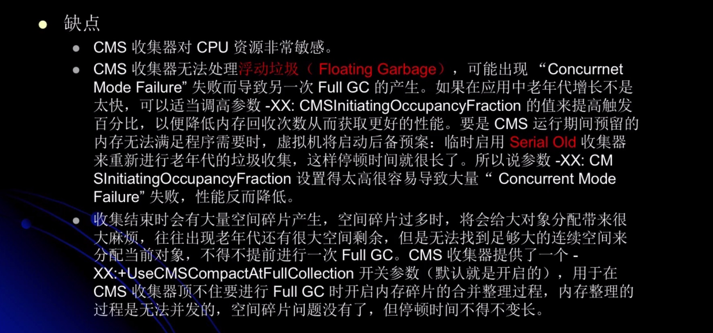

浮动垃圾：之前判断过程中判断某个对象不是垃圾，但是用户线程同时在运行，所以可能在判定之后，清除之前这个对象已经变为了垃圾对象。这是候是没办法处理的。

在CMS出现失败时，老年代还可能使用 Serial Old 垃圾收集器。


***

##### 空间分配担保：

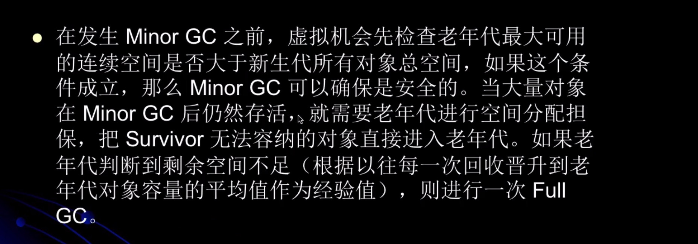

****


#### CMS 收集器收集步骤：

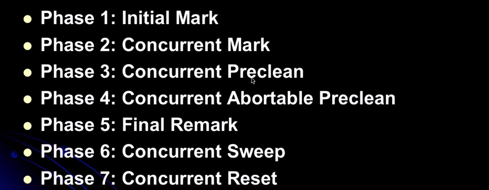


##### 第一个阶段：初始标记

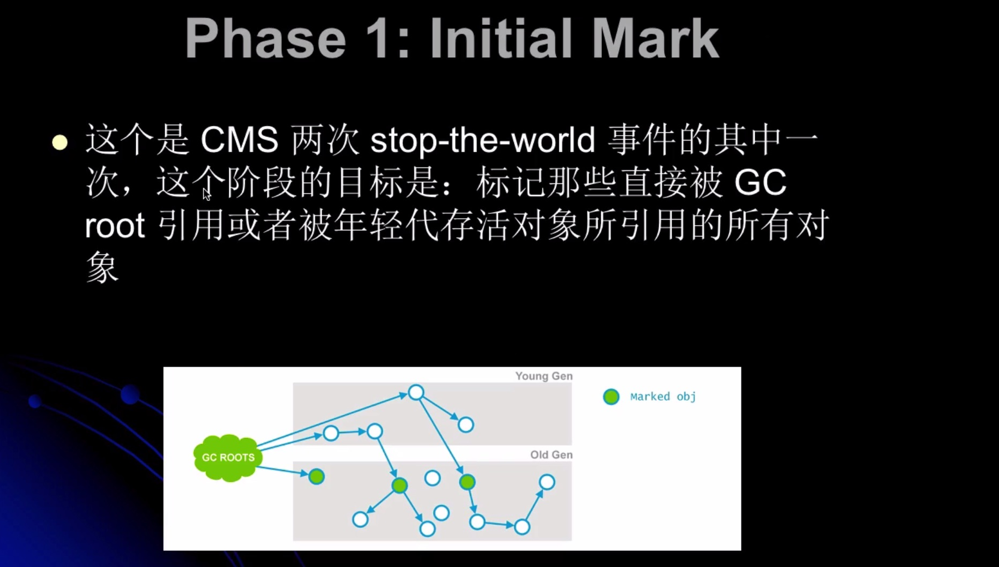

绿色的就是被标记的对象。

这个被年轻代存活对象所引用的所有对象，就是引用老年代的对象了。因为除了年轻代，就只剩老年代了。


##### 第二个阶段：并发标记

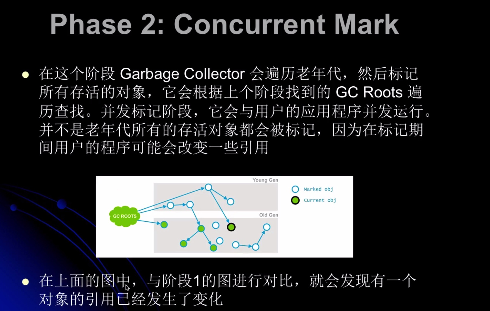


##### 第三个阶段：并发的预先清理

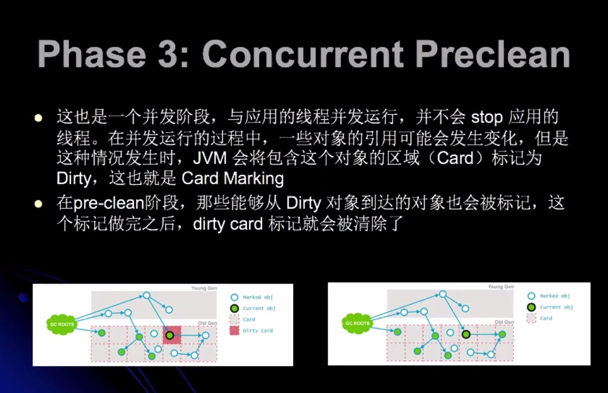

这里表示先把 Card 区域标记为 Dirty，然后标记这个 Dirty对象引用的对象，最后再清除 dirty


##### 第四个阶段：并发的可失败的预先清理

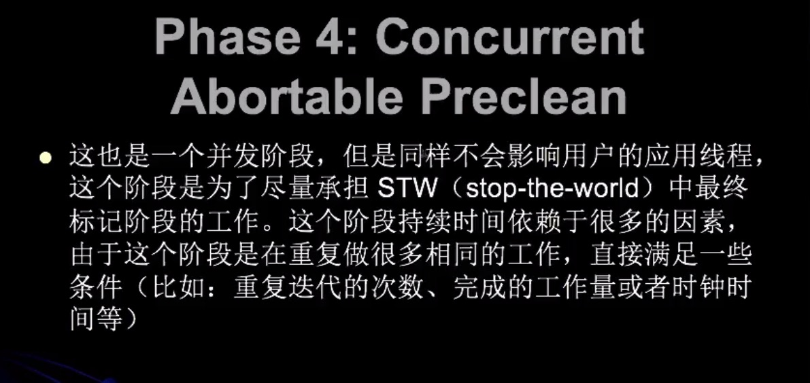


##### 第五个阶段：重新标记

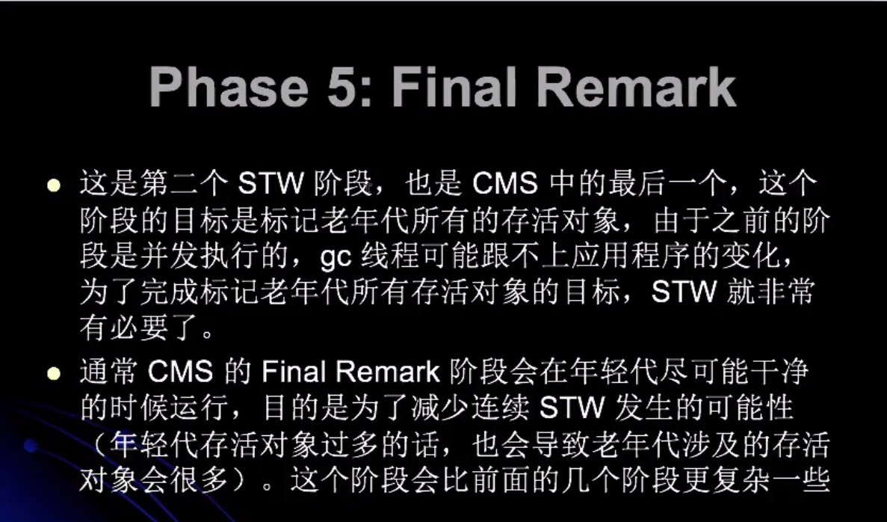


经历了前五个阶段之后，老年代所有存活的对象都被标记过来了，现在就可以通过清除算法去清理那些老年代不再使用的对象。


##### 第六个阶段：并发清除

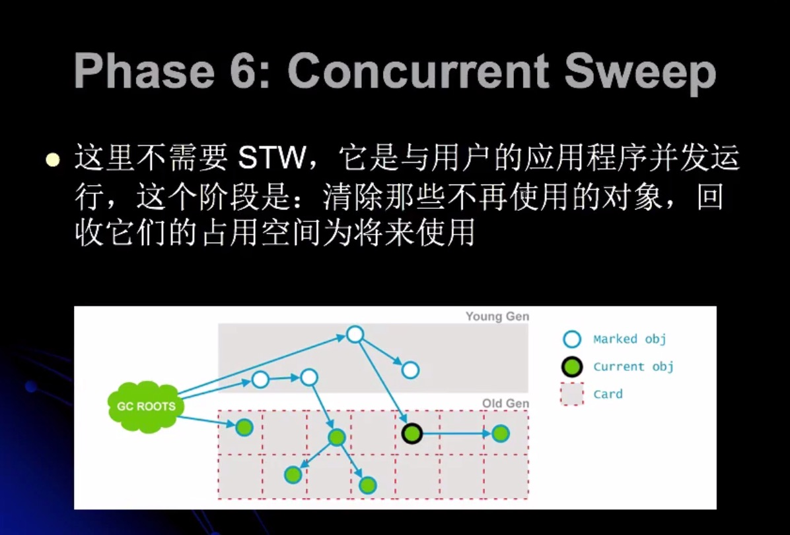


##### 第七个对象：并发重置

这个阶段也是并发执行的，它会重设 CMS 内部的数据结构，为下次的 GC 做准备。


总结：

CMS 通过将大量工作分散到并发处理阶段来减少 STW 时间，在这块做的非常优秀，但是CMS也有一些问题。


***

##### CMS垃圾收集器执行过程：

```java
public class MyTest5 {
    public static void main(String[] args) {
        int size = 1024*1024;

        // 1m = 1026 kb，1kb = 1024 Byte
        byte[] myAllocl = new byte[4*size];
        System.out.println("1111111111");

        byte[] myAllocl2 = new byte[4*size];
        System.out.println("222222222");

        byte[] myAllocl3 = new byte[4*size];
        System.out.println("33333333333");

        byte[] myAllocl4 = new byte[2*size];
        System.out.println("444444444444");

        System.out.println("hello world");
    }
}

```

##### JVM参数:

-verbose:gc
-Xms20M
-Xmx20m
-Xmn10m
-XX:+PrintGCDetails
-XX:SurvivorRatio=8
-XX:+UseConcMarkSweepGC

在选择 CMS 垃圾收集器作为老年代垃圾收集器的时候，JVM 会自动将 ParNew 垃圾收集器作为新生代垃圾收集器


##### 运行结果：

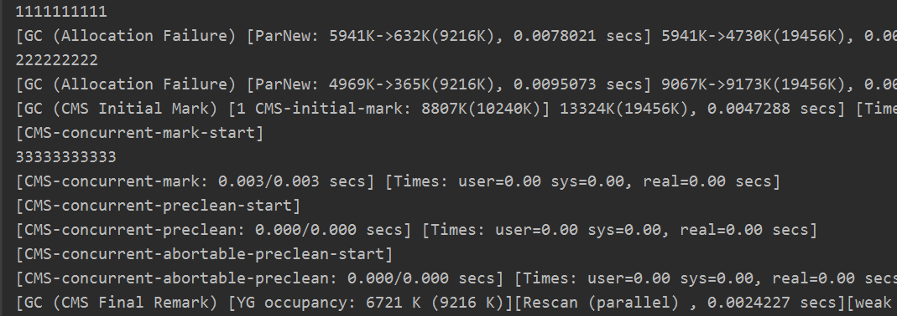

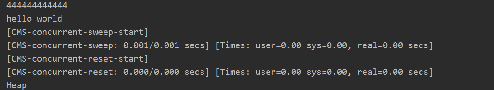


[GC (CMS Initial Mark) [1 CMS-initial-mark: 8807K(10240K)] 13324K(19456K), 0.0047288 secs] [Times: user=0.00 sys=0.00, real=0.00 secs] 

8807k 代表老年代存活对象占据空间大小。


```java
[GC (CMS Final Remark) [YG occupancy: 6721 K (9216 K)][Rescan (parallel) , 0.0024227 secs][weak refs processing, 0.0000259 secs][class unloading, 0.0005945 secs][scrub symbol table, 0.0014044 secs][scrub string table, 0.0003958 secs][1 CMS-remark: 8807K(10240K)] 15529K(19456K), 0.0050765 secs] [Times: user=0.02 sys=0.00, real=0.01 secs] 
```

YG occupancy：年轻代占用的空间；Rescan:重新扫描；class unloading 类卸载；scrub symbol table符号表的处理；scrub string table 表的处理；

