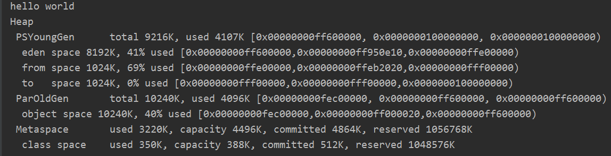
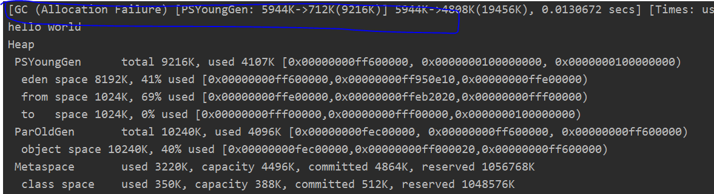
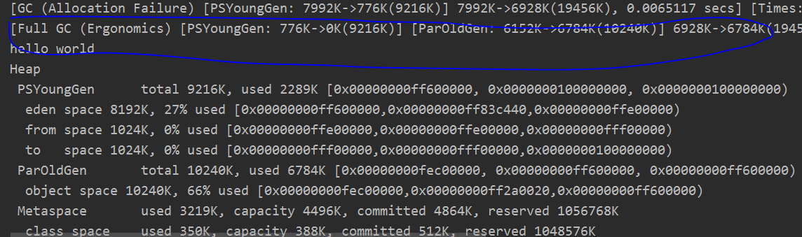
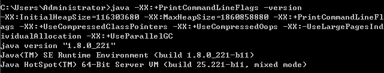
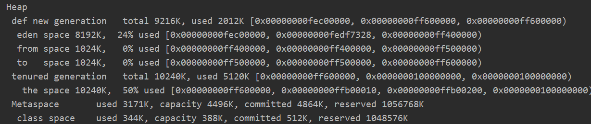
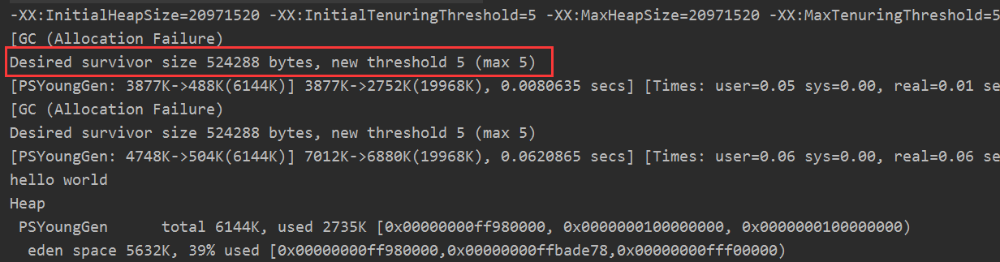
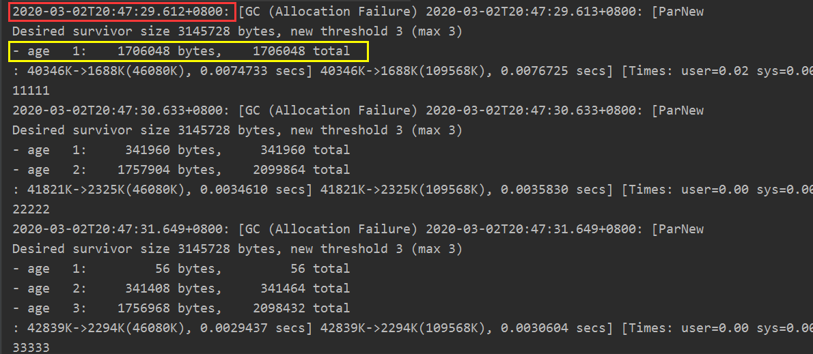

```java
public class MyTest1 {
    public static void main(String[] args) {
        int size = 1024*1024
         // 1024 代表 1m。
        byte[] myAllocl = new byte[2*size];
        byte[] myAllocl2 = new byte[2*size];
        byte[] myAllocl3 = new byte[2*size];
        
	// byte[] myAllocl4 = new byte[2*size];
        
        System.out.println("hello world");
    }
}
```

##### JVM 启动参数;

-verbose:gc     // 输出虚拟机中垃圾回收的详细情况

-Xms20M         // 初始大小

-Xmx20M        // 最大的内存大小 （设置成一样的大小是希望jvm在回收完垃圾以后不出现内存抖动问题）

-Xmn10M          // 新生代大小为 10 m

-XX:+PrintGCDetails     // 打印垃圾回收的详细信息

-XX:SurvivorRatio=8     // Eden空间和 Survivor空间占据的大小比例是 8：1


运行结果：




当改变 byte[] myAllocl3 = new byte[3*size]，再执行结果：

-verbose:gc  只会打印下图中 [GC...]中的内容，而详细的Heap下的内容则是 -XX:+PrintGCDetails参数



这里会发现触发了 gc，这个gc是Minor GC，因为eden区满了。

分析GC信息：

```java
[GC (Allocation Failure) [PSYoungGen: 5944K->712K(9216K)] 5944K->4808K(19456K), 0.0130672 secs] [Times: user=0.00 sys=0.03, real=0.01 secs] 
```

**GC：**gc是Minor GC。如果是FullGC则是full gc。

**（Allocation Failure）：**代表的是这次 GC 的原因，这里是分配失败。

**PSYoungGen：**使用 Parallel Scavenge 收集器收集年轻代垃圾。

**5944K->712K(9216K)：**5944k 代表的是新生代在垃圾回收之前存活的对象占据的空间，712k代表在垃圾回收之后新生代存活的对象占据的空间。（9216k）指的是总的新生代的空间。（这里比之前定义的新生代10m空间少1m的原因是 tosurvivor 空间的 1m 始终是不存放任何对象的，只有垃圾回收完才会存放对象，因此新生代可用容量永远是 8+1的比例大小）

**5944K->4808K(19456K), 0.0130672 secs]：**5844k 指的是在执行这次GC 之前总的存活对象占据的空间大小（包括新生代和老年代），4808k 指的是执行完GC后总的存活对象占据的堆空间的大小。（19456k）总的堆的可用容量。（少的1m是 toSurvivor区的1m）

**0.0130672 secs：**执行这次垃圾回收花费的时间

**[Times: user=0.00 sys=0.03, real=0.01 secs] ：**执行这次垃圾回收，user指在用户空间花费的时间，sys 在内核空间花费的时间，real 实际花费的时间

Heap 下面的信息就是GC具体的信息。


***

问延伸题：

```java
public class MyTest1 {
    public static void main(String[] args) {
        int size = 1024*1024;
        // 1m = 1026 kb，1kb = 1024 Byte
        byte[] myAllocl = new byte[2*size];
        byte[] myAllocl2 = new byte[2*size];
        // 区别在这里
        byte[] myAllocl3 = new byte[2*size];
        byte[] myAllocl4 = new byte[2*size];

        System.out.println("hello world");
    }
}

****************************************************************

public class MyTest1 {
    public static void main(String[] args) {
        int size = 1024*1024;
        // 1024 代表 1m。
        byte[] myAllocl = new byte[2*size];
        byte[] myAllocl2 = new byte[2*size];
        byte[] myAllocl3 = new byte[3*size];
        byte[] myAllocl4 = new byte[3*size];

        System.out.println("hello world");
    }
}

```

运行结果：上半段MyTest1中，创建对象会触发 FUllGC，而下半段不会。



首先，发生GC （即 Minor GC）的原因是新生代满了。

其实，第二种创建对象方式不触发 FullGC 原因是当新生代无法直接容纳下创建的对象，这个对象就会直接在老年代诞生，不会触发FullGC。而第一种是因为空间分配担保。


***

-XX:+PrintCommandLineFlags

打印虚拟机启动的参数信息（这里应该是JVM自带的启动参数）。



-XX:InitialHeapSize  初始的堆大小（单位是字节），和 -Xms参数作用一样

-XX:MaxHeapSize    最大的堆大小，和 -Xmx 参数作用一样

-XX:+UseCompressedClassPointers   使用压缩的类指针。对指针进行 压缩从而减小内存空间。

-XX:+UseCompressedOops      从32 位JVM迁移至 64 位的JVM，指针会进行膨胀。（不必深入了解）

-XX:+UseParallelGC            默认使用 Parallel收集器，在新生代是Parallel Scavenge，老年代则是 ParallelOld

***

##### XX:PretenureSizeThreshold 参数：

源代码：

```java
public class MyTest2 {
    public static void main(String[] args) {
        int size = 1024*1024;
        // 创建的对象的超过了阈值
        byte[] myAllocl = new byte[5*size];
        
    }
}
```

##### jvm 参数：

-verbose:gc
-Xms20m
-Xmx20m
-Xmn10m
-XX:+PrintGCDetails
-XX:SurvivorRatio=8

-XX:PretenureSizeThreshold=4194304

-XX:+UseSerialGC

4194304是字节，表示创建对象的大小一旦超过了这个值，那么对象直接在老年代创建。

这个参数需要和串行收集器一起使用，串行收集器即 SerialGC。不然因为垃圾收集器的影响，不会直接在老年代创建，即参数不起作用。


##### 运行结果：



这里新生代和老年代已经变化了。因为垃圾收集器的影响。


System.gc ()的作用就是告诉JVM执行垃圾回收，但是什么时候执行垃圾回收是不确定的，由JVM决定。System.gc 的意义是所有的垃圾收集都是在产生对象的时候内存不够才会发生，而System.gc的存再可以在程序执行过程中执行垃圾回收，它实质上是 FullGC。


***

##### MaxTenuringThreshold 参数：

```java
public class MyTest3 {
    public static void main(String[] args) {
        int size = 1024*1024;
        // 1m = 1026 kb，1kb = 1024 Byte
        byte[] myAllocl = new byte[2*size];
        byte[] myAllocl2 = new byte[2*size];
        byte[] myAllocl3 = new byte[2*size];
        byte[] myAllocl4 = new byte[2*size];

        System.out.println("hello world");
    }
}

```


##### JVM参数：

-verbose:gc
-Xms20M
-Xmx20M
-XX:+PrintGCDetails
-XX:+PrintCommandLineFlags
-XX:SurvivorRatio=8
-XX:+PrintTenuringDistribution     // 打印晋升信息

-XX:+MaxTenuringThreshold=5        // 对象晋升的存活年龄

在可以自动调节对象晋升（Promote）到老念代阈值的GC中，设置该阈值的最大值。

解释：当一个对象在新生代中经历过一次Minor GC后，它的对象年龄会+1,当超过阈值 5 后，会晋升到老年代。但是这个参数设置的值只是一个理论值，可能 JVM 在某个对象年龄达到2就会晋升老年代，原因是 JVM 可以自动的调节这个阈值，但是不会超过我们设置的这个阈值。该参数的默认值是15，CMS 中默认是 6，G1 中默认是 15（在JVM中，该数值是由4个bit来表示的，所以最大值是1111，即15）

​		经历了多次 GC后，存活的对象会在 From  Surivor 与 To Survor之间来回存放的，而这里面的一个前提则是这两个空间有足够的大小来存放这些数据，在GC算法中，会计算每个对象年龄的大小，如果达到了某个年龄后发现总的大小已经大于一个Survivor空间的 50%，那么这时候就需要调整阈值，不能再继续等到默认的 15 次 GC 后才完成晋升，因为这样会导致 survivor 空间不足，所以需要调整阈值，让这些存活对象尽快完成晋升。


##### 运行结果：



​		前面这是所需要的survivor空间，new threshold 5，代表jvm自己生产的阈值，后面是最大的阈值，也就是这里我们设置的。


***

##### TargetSurvivorRatio 参数：

```java
public class MyTest4 {
    
        public static void main(String[] args) throws InterruptedException {
            byte[] byte1= new byte[512*1024];
            byte[] byte2= new byte[512*1024];
    
            // 这里这样写的目的是让对象的年龄不断增加，而通过 myGC() 去触发gc
            myGC();
            Thread.sleep(1000);
            System.out.println("11111");
    
            myGC();
            Thread.sleep(1000);
            System.out.println("22222");
    
            myGC();
            Thread.sleep(1000);
            System.out.println("33333");
    
            myGC();
            Thread.sleep(1000);
            System.out.println("44444");
    
            byte[] byte3= new byte[1024*1024];
            byte[] byte4= new byte[1024*1024];
            byte[] byte5= new byte[1024*1024];
    
            myGC();
            Thread.sleep(1000);
            System.out.println("55555");
    
            myGC();
            Thread.sleep(1000);
            System.out.println("66666");
    
            System.out.println("hello world");
        }
    
        private static void myGC(){
            for (int i = 0; i < 40;i++){
                byte[] bytes = new byte[1024*1024];
            }
        }
    }
```

##### JVM参数：

-verbose:gc
-Xmx200m
-Xmn50m
-XX:TargetSurvivorRatio=60
-XX:+PrintTenuringDistribution
-XX:+PrintGCDetails
-XX:+PrintGCDateStamps       // 打印GC执行的时间戳
-XX:+UseConcMarkSweepGC     // 老年代使用 CMS 收集器。因此这个算法就是在老年代的
-XX:+UseParNewGC            // 新生代使用 parnew 垃圾收集器
-XX:MaxTenuringThreshold=3

-XX:TargetSurvivorRatio=60  ： Survivor 空间被存活的对象占据60%后，就会重新计算对象晋升阈值，而不用自己设置的。


##### 运行结果：



​		在第一次创建对象以后，进行一次 gc,这时候所有没有被回收的对象年龄变为1，这里的 1706048 代表的就是所有年龄为 1 的对象占据的空间大小。