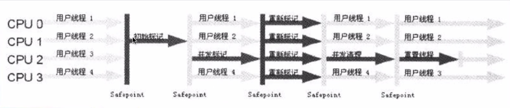

#### JVM 运行时数据区域-例子

```java
public void method1(){
    Object obj = new Object();
}
```

生成了2部分的内存区域，1）obj 这个引用变量，因为是方法内的变量，方法 JVM Stack 里面。2）真正的Object class的实例对象，放到 Heap 里面。

上面的 new 语句一共消耗了 12 byte，jvm 归档引用占 4个 bytes（在JVM Stack），而空对象是 8 个 byte（在 Heap）

方法结束后，对应的 Stack 中的变量马上回收，但是 Heap 中的对象要等到 GC 来回收。

***

#### JVM垃圾回收（GC）模型：

* 垃圾判断算法
* GC 算法
* 垃圾回收器的实现和选择

***


#### 垃圾判断的算法

> * 引用计数算法（Reference Counting）
> * 根搜索算法（Root Tracing）


##### 引用计数算法：

> ​	给对象添加一个引用计数器，但有一个地方引用它，计数器加1，当引用实现，计数器减 1，任何时刻计数器为 0 的对象就是不肯再被使用的。
>
> 引用计数算法无法解决对象循环引用的问题。


循环引用：

​	     A类持有B类对象，B类持有A类。在之前，可能会有其他引用分别指向这两个类，但是渐渐消失。最后剩下 A，B类相互引用，而这时候不会有其他类的引用，这两个类是没作用了。但是引用计数算法会判断计数器是否为0.此时A,B都是1，故而无法被回收，浪费空间。


##### 根搜索算法：

> 在实际的生产语言中（Java、C#等），都是使用根搜索算法判断对象是否存活。
>
> ​		算法基本思路就是通过一系列的称之为"GC Roots"的点作为起始进行向下搜索，当一个对象到 GC Roots 没有任何引用链（Reference Chain）相连，则证明此对象是不可用的。

在Java 语言中，GC Roots 包括：

* 在 VM 栈（帧中的本地变量）中的引用
* 方法区中的静态引用
* JNI （即一般说的 Native 方法）中的引用


***

#### 方法区 GC：

Java 虚拟机规范表示可以不要求虚拟机在这区实现GC,这区的GC“性价比”一般比较低。

在堆中，尤其是新生代，常规应用进行一次 GC 一般可以回收 70%~95% 的空间，而方法区的 GC 效率远小于此。

当前商业 JVM 都有实现方法区的 GC，主要回收两部分内容：废弃常量与无用类。

##### 类回收需要满足如下 3 个条件：

* 该类所有的实例都已被 GC，也就是JVM中不存在该 Class 的任何实例
* 加载该类的 ClassLoader 已被 GC
* 该类对应的java.lang.Class对象没有在任何地方被引用，如不能在任何地方通过反射访问该方法


在大量使用反射、动态代理、CGLib 等字节码框架、动态生成JSP以及OSGi这类频繁自定义 ClassLoader的场景都需要 JVM 具备类卸载的支持以保证方法区不会溢出

***


#### JVM 常见的 GC 算法：

> * 标记-清除算法 （Marking - Sweep）
> * 标记-整理算法 （Mark-Compact）
> * 复制算法（Copying）
> * 分代算法（Generational）


***


#### 内存分配：

##### 1、堆上分配

  大多数情况在 eden 上分配，偶尔会直接在 old 上分配。细节取决于 GC 的实现。

##### 2、栈上分配

原子类型的局部变量


***


#### 内存回收：

GC 要做的是将那些 dead  的对象所占用的内存回收掉

HotSpot 认为没有引用的对象是 dead 的

HotSpot 将引用分为四种：Strong、Soft、Weak、Phantom（即强引用，软引用，弱引用，虚引用）

* Strong 即默认的通过 Object o = new Object() 这种方法赋值的引用
* Soft、Weak、Phantom 这三种则都是继承 Reference


在进行 Full GC 时会对 Reference 类型的引用进行特殊处理

* Soft：内存不够时一定会被GC，长期不用也会被 GC
* Weak：一定会被 GC，当被 mark 为 dead ，会在 ReferenceQueue 中通知
* Phantom：本来就没有引用，当从 jvm heap 中释放时会通知

***


#### GC 的时机：

在分代模型的基础上，GC从时机上分为两种：Scavenege GC 和 Full GC

##### Scavenege GC（又称Minor GC）：

* 触发时机：新对象生成时，Eden空间满了
* 理论上 eden 区大多数对象会在 Scavenge GC  回收，复制算法的执行效率会很高，Scavenge GC 时机比较短。

##### Full GC：

* 对整个 JVM 进行整理，包括Young、Old和Perm（现在没有永久代概念，其实应该是方法区，但是对元空间的回收是效率极低的，因此很少会回收）
* 主要的触发时机：1）Old 满了；2）老年代担保失败。3）system.gc()；
* 效率很低，尽量减少 Full GC

一定要避免在出现 Full GC。整个业务线程都会暂停一段时间。


***


#### 垃圾回收器（Garabage Collector）：

* 分代模型：GC 的宏观愿景；

* 垃圾回收器：GC算法的具体实现

* HotSpot JVM 提供多种垃圾回收器，我们需要根据具体应用的需求采用不同的回收器。

* 没有万能的垃圾回收器，每种垃圾回收器都有自己的适用场景


***


#### 垃圾收集器的“并行”和“并发”

* 并行（Parallel）：指多个收集器的线程同步工作，但是用户的线程处于等待状态。

* 并发（Concurrent）：指收集器在工作的同时，可以允许用户线程工作

  ​		并发不代表解决了GC停顿问题，在关键的步骤还是要停顿的。比如在收集器标记垃圾的时候。但是在清除垃圾的时候，用户线程可以和GC线程并发执行。


##### Serial 收集器：

* 单线程收集器，收集时会暂停所有的工作线程（Stop The Word,检查STW），使用复制收集算法，虚拟机运行在 Client 模式时的默认新生代收集器。
* New 和 Old Generation 都可以使用。在新生代，采用复制算法；在老年代，采用Mark-Compact 算法。
* 因为是单线程 GC，没有多线程切换的额外开销，简单实用。


##### ParNew收集器：

* ParNew 收集器就是 Serial 的多线程版本，除了使用多个收集线程外，其余行为包括算法、STW、对象分配规则、回收策略等都与 Serial 收集器一模一样。

* 对应的这种收集器是虚拟机运行在 Server 模式的默认新生代收集器，在单 CPU 的环境中，ParNew 收集器并不会比 Serial 收集器有更好的效果。只有在多CPU 的环境下，效率才会比 Serial 收集器要高。
* 可以通过 -XX：ParallelGCThreads 来控制 GC 线程数的多少。需要结合具体CPU的个数。


##### Parallel Scavenge 收集器：

* Parallel Scavenge 收集器也是一个多线程收集器，也是使用复制算法，但它的对象分配规则与回收策略都与 ParNew 收集器有所不同，它是以吞吐量最大化（即GC 时间占总运行时间最小）为目的的收集器实现，它运行较长时间的 STW 换取总吞吐量最大化。

* JDK 1.8 默认在 新生代的垃圾收集器


##### Serial Old 收集器：

Serial Old 是单线程的收集器，使用标记-整理算法，是老年代的收集器。


##### Parallel Old 收集器：

老年版本吞吐量优先级收集器，使用多线程和标记-整理算法，JVM1.6 提供，在此之前，新生代使用了 PS 收集器的话，老年代除 Serial Old 外别无选择，因为PS 无法与 CMS 收集器配合工作。

* Parallel Scavenge 在老年代的实现
* 在JVM 1.6 才出现Parallel Old
* 采用多线程，Mark -Compact 算法
* JDK 1.8 默认在 老年代的垃圾收集器


##### CMS（Concurrent Mark Sweep） 收集器

CMS 是一种以最短停顿时间为目标的收集器，使得 CMS 并不能达到 GC 效率最高（总体 GC 时间最小），但它能尽可能降低 GC 时服务的停顿时间，CMS 收集器使用的是标记-清除算法。

* 追求最短的停顿时间，非常适合 Web 应用
* 只针对老年区，一般结合 parNew 使用
* GC 线程和用户线程并发工作（尽量并发）
* 只有在多 CPU 环境下才有意义
* 使用 -XX:+UseConcMarkSweepGC 打开

缺点：

* CMS 以牺牲 CPU 资源的代价来减少用户线程的停顿。当 CPU 个数少于 4的时候，有可能对吞吐量影响非常大
* CMS 在并发清理的过程中，用户线程还在跑。这时候需要预留一部分空间给用户线程。
* CMS 用 Mark-Sweep ，会带来碎片问题。碎片过多的时候会容易频繁触发 Full GC。




