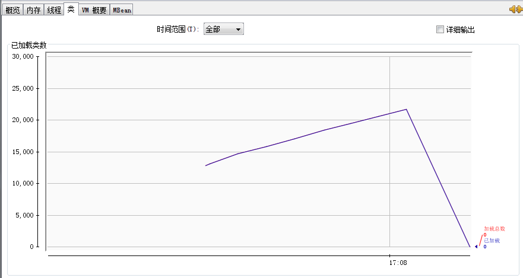
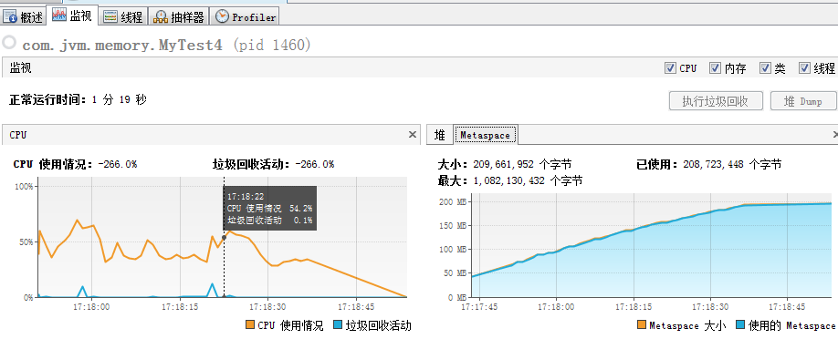
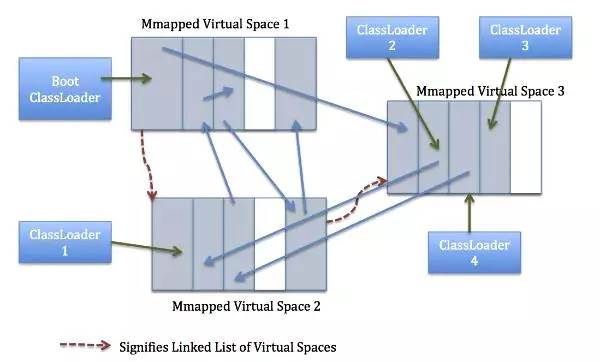

源代码：

```java
/*
    方法区产生内存溢出错误（一般很难发生这个错误）。
    Cglib，可以在程序运行期动态的生成类，这些生成类的元数据就会落入方法区。在jdk8中元空间默认大小是21m，如果超过21m，虚拟机会垃圾回收。如果还是不够，就对元空间动态扩容，直到主机物理内存上限。
* */

public class MyTest4 {
    public static void main(String[] args) {
        for (;;){
            Enhancer enhancer = new Enhancer();
            enhancer.setSuperclass(MyTest4.class);
            enhancer.setUseCache(false);
            enhancer.setCallback((MethodInterceptor)(obj,method,args1,proxy)->proxy.invokeSuper(obj,args1));

            System.out.println("hello  world");

            enhancer.create();
        }
    }
}
```

元空间在达到默认的 20m 大小后，会自动扩容。设置参数，不让其扩容。

```java
-XX:MaxMetaspaceSize=200m
```

设置最大的元空间为 200m,设置为200是因为程序运行的速度太快，不够监测工具打开就执行完了。


运行结果：

```java
.......
hello  world
hello  world
Exception in thread "main" java.lang.OutOfMemoryError: Metaspace
	at org.springframework.cglib.core.AbstractClassGenerator.create(AbstractClassGenerator.java:256)
	at org.springframework.cglib.proxy.Enhancer.createHelper(Enhancer.java:378)
	at org.springframework.cglib.proxy.Enhancer.create(Enhancer.java:286)
	at com.jvm.memory.MyTest4.main(MyTest4.java:29)

```


#### 用 jconsole 工具分析：

会发现类在不断的增加。

这里点击详细输出，控制台就会输出类的加载情况，和TraceClassLoading 参数效果一样。因为这是一个监控进程，它会attach到jvm上，去改变 jvm 输出结果。




#### 用jvisualvm分析：

会发现监视面板的 Metaspace 一直增加，直到200m。这说明元空间的信息在一直增加。



***


#### 元空间定义：

​		在 Java 虚拟机中（以下简称JVm）中，类包含其对应的元数据，比如类的层级信息，方法数据和方法信息（如字节码，栈和变量大小），运行时常量池，已确定的符号引用和虚方法表。

​		在过去（当自定义类加载器使用不普遍的时候），类几乎是“静态的”并且很少被卸载回收，因此类也可以被看成“永久代”。另外由于类作为 JVM 实现的一部分，它们不由程序来创建，因此它们也被认为是“非堆”的内存

> 静态的是说在以前，基本不会再运行期动态的生成类，类是写好了再编译的。

​    	在JDK8 之前的 HotSpot 虚拟机中，类的这些“永久的”数据存放在一个叫做永久代的区域。永久代一段连续的内存空间，我们在 JVM 启动之前可以通过设置 -XX:MaxPermSize 的值来控制永久代的大小，32为机器默永久代大小为64m，64位机器则为 85m。永久代的垃圾回收和老年代的垃圾回收是绑定的，一旦启动一个区域被占满，这两个区域都要进行垃圾回收。但是也有一个明显的问题，由于我们可以通过 -XX:MaxPermSize 设置永久代的大小，一旦类的元数据超过了设定的大小，程序就会耗尽内存，并出现内存溢出错误（OOM）

备注：在 JDK 7 之前的 HotSpot 虚拟机中，纳入字符串常量池的字符串被存储在永久代中，因此导致了一系列的性能问题和内存溢出错误。

####  移除永久代的影响

​		随着Java8的到来，我们再也见不到永久代了。但是这并不意味着类的元数据信息也消失了。这些数据被移到了一个与堆不相连的本地内存区域，这个区域就是我们要提到的元空间。

​		这项改动是很有必要的，因为对永久代进行调优是很困难的。永久代中的元数据可能会随着每一次Full GC发生而进行移动。并且为永久代设置空间大小也是很难确定的，因为这其中有很多影响因素，比如类的总数，常量池的大小和方法数量等。

​		同时，HotSpot虚拟机的每种类型的垃圾回收器都需要特殊处理永久代中的元数据。将元数据从永久代剥离出来，不仅实现了对元空间的无缝管理，还可以简化Full GC以及对以后的并发隔离类元数据等方面进行优化。 


#### 移除永久代的影响

​		由于类的元数据分配在本地内存中，元空间的最大可分配空间就是系统可用内存空间。因此，我们就不会遇到永久代存在时的内存溢出错误，也不会出现泄漏的数据移到交换区这样的事情。最终用户可以为元空间设置一个可用空间最大值，如果不进行设置，JVM会自动根据类的元数据大小动态增加元空间的容量。

​		注意：永久代的移除并不代表自定义的类加载器泄露问题就解决了。因此，你还必须监控你的内存消耗情况，因为一旦发生泄漏，会占用你的大量本地内存，并且还可能导致交换区交换更加糟糕。


#### 元空间内存管理

​		`元空间的内存管理由 元空间虚拟机来完成。`先前，对于类的元数据我们需要不同的垃圾回收器进行处理，现在只需要执行元空间虚拟机的C++代码即可完成。在元空间中，类和其元数据的生命周期和其对应的类加载器是相同的。话句话说，只要类加载器存活，其加载的类的元数据也是存活的，因而不会被回收掉。

​		我们从行文到现在提到的元空间稍微有点不严谨。准确的来说，`每一个类加载器的存储区域都称作一个元空间，所有的元空间合在一起就是我们一直说的元空间。`当一个类加载器被垃圾回收器标记为不再存活，其对应的元空间会被回收。在元空间的回收过程中没有重定位和压缩等操作。但是元空间内的元数据会进行扫描来确定Java引用。

​		元空间虚拟机负责元空间的分配，其采用的形式为组块分配。组块的大小因类加载器的类型而异。在元空间虚拟机中存在一个全局的空闲组块列表。当一个类加载器需要组块时，它就会从这个全局的组块列表中获取并维持一个自己的组块列表。当一个类加载器不再存活，那么其持有的组块将会被释放，并返回给全局组块列表。类加载器持有的组块又会被分成多个块，每一个块存储一个单元的元信息。组块中的块是线性分配（指针碰撞分配形式）。组块分配自内存映射区域。这些全局的虚拟内存映射区域以链表形式连接，一旦某个虚拟内存映射区域清空，这部分内存就会返回给操作系统。



上图展示的是虚拟内存映射区域如何进行元组块的分配。类加载器1和3表明使用了反射或者为匿名类加载器，他们使用了特定大小组块。 而类加载器2和4根据其内部条目的数量使用小型或者中型的组块。


#### 元空间调优与工具

​		正如上面提到的，元空间虚拟机控制元空间的增长。但是有些时候我们想限制其增长，比如通过显式在命令行中设置-XX:MaxMetaspaceSize。默认情况下，-XX:MaxMetaspaceSize的值没有限制，因此元空间甚至可以延伸到交换区，但是这时候当我们进行本地内存分配时将会失败。

​		对于一个64位的服务器端JVM来说，其默认的–XX:MetaspaceSize值为21MB。这就是初始的高水位线。一旦触及到这个水位线，Full GC将会被触发并卸载没有用的类（即这些类对应的类加载器不再存活），然后这个高水位线将会重置。新的高水位线的值取决于GC后释放了多少元空间。如果释放的空间不足，这个高水位线则上升。如果释放空间过多，则高水位线下降。如果初始化的高水位线设置过低，上述高水位线调整情况会发生很多次。通过垃圾回收器的日志我们可以观察到Full GC多次调用。为了避免频繁的GC，建议将–XX:MetaspaceSize设置为一个相对较高的值。

​		经过多次GC之后，元空间虚拟机自动调节高水位线，以此来推迟下一次垃圾回收到来。

​		有这样两个选项 ‑XX:MinMetaspaceFreeRatio和‑XX:MaxMetaspaceFreeRatio，他们类似于GC的FreeRatio选项，用来设置元空间空闲比例的最大值和最小值。我们可以通过命令行对这两个选项设置对应的值。

下面是一些改进的工具，用来获取更多关于元空间的信息。

**jmap -clstats PID 打印类加载器数据。**（-clstats是-permstat的替代方案，在JDK8之前，-permstat用来打印类加载器的数据）。

**jstat -gc LVMID 用来打印元空间的信息。**

**jcmd PID GC.class_stats 一个新的诊断命令，用来连接到运行的JVM并输出详尽的类元数据的柱状图。**


#### 存在的问题

​		前面已经提到，元空间虚拟机采用了组块分配的形式，同时区块的大小由类加载器类型决定。类信息并不是固定大小，因此有可能分配的空闲区块和类需要的区块大小不同，这种情况下可能导致碎片存在。元空间虚拟机目前并不支持压缩操作，所以碎片化是目前最大的问题。