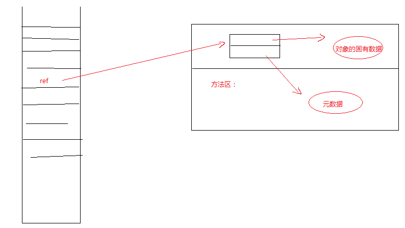
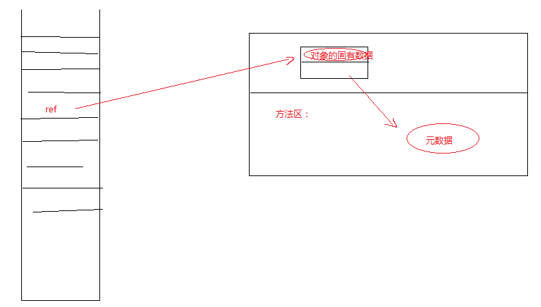

#### 1、虚拟机栈：

​	主要数据是栈帧，Stack Frame 栈帧程序计数器（Program Counter）。线程私有的内存空间，当线程创建的时候，与之相关的虚拟机栈就诞生了，当线程消亡了，与之对应的虚拟机栈也就消失。

​	引用类型不是对象，它存在于局部变量表，包括八种原生类型。如果是八个原生类型，则直接把值放入局部变量表中。在 HotSpot 虚拟机中直接将虚拟机栈和本地方法栈合二为一了。

Java虚拟机栈描述的是 Java 方法的执行模型：每个方法执行的时候都会创建一个帧（Frame）。栈用于存放局部变量，操作数栈，动态链接，动态链接，方法出口等信息。一个方法的执行过程，就是这个方法对于栈帧的入栈过程。这个JVM栈和操作数栈是有区别的。

#### 2、程序计数器（Program Counter）：

主要标识当前线程执行代码的行号，存放下一条执行代码的位置，比如第三行执行完后执行到哪行，可能执行到第四行，也可能执行到第八行。

​       还有多个线程同时执行的时候，按照时间片的方式，多个线程轮执行，比如在第一个线程执行到一半的时候执行其他线程，这时候程序计数器就得记住线程挂起的位置。其他的线程是不能获取这个线程的代码执行的位置，即程序计数器线程私有的。

#### 3、本地方法栈：

主要用于处理本地方法。

#### 4、堆（heap）：

  	  JVM管理的最大的一块内存，与堆相关的一个重要的概念就是垃圾收集器。现代几乎所有的垃圾收集器都是采用的分代垃圾算法，所以堆空间也是基于这一点进行了相应的划分：新生代，老年代。更具体划分Eden空间，From Survivor 空间 与 To Survivor空间。我们所创建的对象默认情况下才会进入新生代，可以收到更改进入老年代，但是一般不这样做。

Java 的堆空间在物理内存上可以是连续的也可以是不连续的。

所有线程共享。java是通过引用操作对象，引用是位于虚拟机栈中的，而实例本身位于堆中。

对象本身分为两部分内容：一部分是对象本身的固有的实例数据，另一部分是对象的元数据（Class对象等信息）。元数据和实例数据又不是位于同一个地方，而元数据位于方法区，对象本身的数据位于堆中。因此一个对象是位于两个不同地方。

##### 对象的指向有两种引用方式：

1、指向的并不是对象本身，而是一个句柄，句柄又分为两部分，一个指向堆中实例数据，一个指向方法区的元数据信息。

2、指向的还是这个对象，包含两部分，一部分是实例数据，另一部分是指向元数据的指针，元数据还是存在于方法区。oracle的hotpot虚拟机用的是这种。

​        第一种方法没被采用是因为在垃圾回收的时候，ref指向的对象的位置可能会更改，这时候指针指向的对象的固有数据也位置要不断的更改，而第二种只需要ref指向的位置即可。

#### 5、方法区（Method Area）：

存放了每个 Class 的结构信息，包括常量池、字段描述、方法描述。

存储元信息，比如Class对象被卸载的时候才会被回收，但是很少很少。

永久代（Permanent Generation），这里的信息很少会被垃圾回收，故而有些称方法区为永久代。但是永久代和方法区不完全等价，从1.8开始，已经彻底废弃了永久代，使用了元空间（meta space）。

​       在jdk8中元空间默认大小是21m，如果超过21m，虚拟机会垃圾回收。如果还是不够，就对元空间动态扩容，直到主机物理内存上限。

在大量使用反射、动态代理、CGLib 等字节码框架、动态生成 JSP 以及 OSGI 这类频繁自定义 ClassLoader 的场景都需要 JVM 具备类卸载的支持以保证方法区不会溢出。

#### 6、运行时常量池：

在编译期间就能确定好的。是方法区一部分内容，就是字节码中的常量池，再加载完以后就会进入运行时常量池。

#### 7、直接内存（Direct Memory）：

本身不是由jvm管理的，而是由操作系统管理的。JVM 通过堆上的 DirectByteBuffer 来操作直接内存。效率比较高。