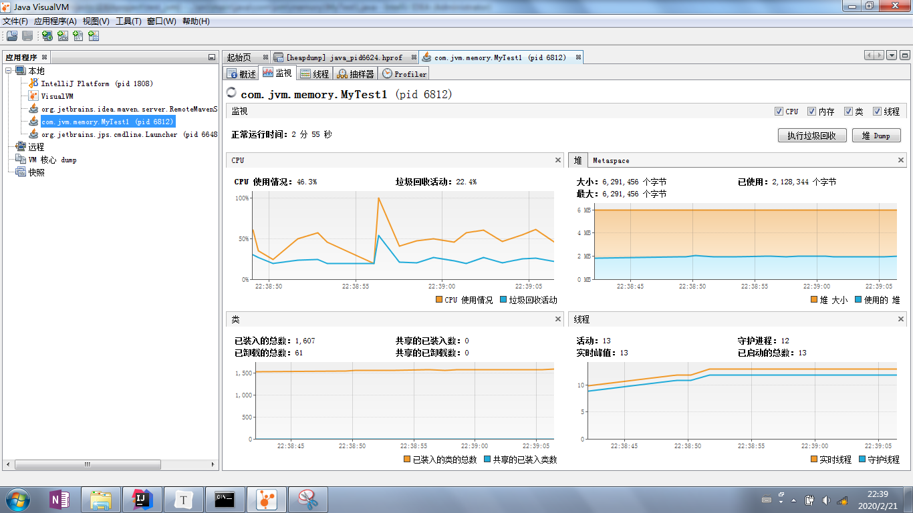

主要就是堆里面对象内存的分析。


##### 关于Java对象创建的过程：

##### new关键字创建对象的3个步骤：

1、在堆空间中创建对象的实例。

2、为对象的实例成员变量赋初值。

3、将对象的引用返回。


##### 深入理解步骤：

1、在堆空间创建对象有两种方式：

> * 指针碰撞：如果堆中的空间通过一个指针进行分割，一侧是被占用空间，另一侧是未被占用空间，当对象被创建的时候，就会放在未使用的空间，指针发生偏移。
>
> * 空闲列表：如果是已被使用的内存和未被使用的内存是交织在一起的，这时，虚拟机就需要通过一个列表来记录哪些空间是可以使用的，哪些空间是已被使用的，接下来 找出可以容纳下新创建对象的且未被使用的空间，在此空间存放该对象，同时还要修改列表上的记录。这两种情况出现的原因和垃圾收集算法有关，有种算法在清除完垃圾后，是不会改变其他对象位置的，就会出现已被使用的内存和未被使用的内存是交织在一起，所以创建对象就会使用空闲列表这种方式。指针碰撞则是清除垃圾

2、赋初值就是调用 <init> 方法。

3、把地址赋值给局部变量表里面的引用


##### 对象在内存中的布局（即对象包含的信息）：

1、对象头。对象执行时的一些信息，比如哈希吗等。

2、真正的实例数据。即我们在一个类中所声明的各项信息

3、对齐填充 （比如数据不够八位，补零。这里知道这个概念就ok了）


***

#### TLAB：

虽然堆内存是线程共享的，但是TLAB区是线程私有的。

​		JVM在内存新生代Eden Space中开辟了一小块线程私有的区域，称作TLAB（Thread-local allocation buffer）。默认设定为占用Eden Space的1%。在Java程序中很多对象都是小对象且用过即丢，它们不存在线程共享也适合被快速GC，所以对于小对象通常JVM会优先分配在TLAB上，并且TLAB上的分配由于是线程私有所以没有锁开销。因此在实践中分配多个小对象的效率通常比分配一个大对象的效率要高。
​		也就是说，Java中每个线程都会有自己的缓冲区称作TLAB（Thread-local allocation buffer），每个TLAB都只有一个线程可以操作，TLAB结合bump-the-pointer技术可以实现快速的对象分配，而不需要任何的锁进行同步，也就是说，在对象分配的时候不用锁住整个堆，而只需要在自己的缓冲区分配即可。


***

创建对象出现的两个典型的问题。

#### java.lang.OutOfMemoryError：

出现这个错误意味着虚拟机挂掉了，没办法正常执行。

源代码：

```java
public class MyTest1 {

    public static void main(String[] args) {
        List<MyTest1> list = new ArrayList<>();
        for (;;){   //这里故意不断的创建对象。
            list.add(new MyTest1());
        }
    }
}
```

因为本身内存空间可能比较大，创建的对象可能比较久才会满。因此加入下面的虚拟机参数：

```java
-Xms5m -Xmx5m -XX:+HeapDumpOnOutOfMemoryError
```

第一个参数最小的堆内存空间，第二个最大的堆内存空间，第三个是转储堆内存的错误到磁盘上。


运行结果：

```
java.lang.OutOfMemoryError: Java heap space
Dumping heap to java_pid6624.hprof ...    // 出错的进程号
Heap dump file created [9368685 bytes in 0.321 secs]
Exception in thread "main" java.lang.OutOfMemoryError: Java heap space
	at java.util.Arrays.copyOf(Arrays.java:3210)
	at java.util.Arrays.copyOf(Arrays.java:3181)
	at java.util.ArrayList.grow(ArrayList.java:265)
	at java.util.ArrayList.ensureExplicitCapacity(ArrayList.java:239)
	at java.util.ArrayList.ensureCapacityInternal(ArrayList.java:231)
	at java.util.ArrayList.add(ArrayList.java:462)
	at com.jvm.memory.MyTest1.main(MyTest1.java:55)

Process finished with exit code 1

```


#### 用  jvisualvm 工具分析：

在命令行窗口输入 jvisualvm 命令即可打开工具。

文件 -> 装入。选择 hprof 格式，打开转储的堆错误信息文件。


##### 工具面板说明：

概要就是错误信息的概要，类是所有加载的类，实例是类的实例（具体查看的话右击类里面的类名选择在实例视图中显示），OQL 控制台允许自定义语句进行一些操作。


这些可视化的界面可以保存出现的错误，然后分析错误的地方。这里很明显是MyTest1 出现了错误。


现在更改源代码：

```java
public class MyTest1 {

    public static void main(String[] args) {
        List<MyTest1> list = new ArrayList<>();
        for (;;){
            list.add(new MyTest1());

            // 调用gc方法，jvm就会尽力去回收内存空间中没被使用的对象。（绝对不推荐程序中使用此方法，因为有它自己单独的线程回收垃圾）
            // 这里表示的是每次创建对象都 gc 一次。
            System.gc();
        }
    }
```

程序并不会保存，而是一直在执行。打开 jvisualvm ，双击当前活动的线程，可以看到如下。



​        正常情况下，cpu 的垃圾回收活动并不会如此频繁。右边堆可以看出，这里内存空间一直比较稳定，因为每一次 new 对象以后都显示的被我们 gc 了。但是如果内存空间过小，即使在不断地gc，还是会出现OutOfMemoryError的错误。

***

#### java.lang.StackOverflowError：

源代码：

```java
public class MyTest2 {
    private int length;

    public int getLength(){
        return length;
    }

    public void test(){
        this.length++;

        // 注意，在加入这里的线程停止的时候，是不会有打印结果，因为每次调用大都有等待。
          try{
            // 让线程睡眠，不然直接报错不好观察
            Thread.sleep(300);
        } catch (InterruptedException e) {
            e.printStackTrace();
        }
        
        test();
    }

    public static void main(String[] args) {
        MyTest2 myTest2 = new MyTest2();

        try{
            myTest2.test();
        }catch (Throwable ex){
            System.out.println(myTest2.getLength());
            ex.printStackTrace();
        }
    }
}
```

因为本身栈空间比较大，可能比较久才报错。因此加入下面的虚拟机参数改变栈的大小：

```java
-Xss100k
```

最小的堆内存。


运行结果：

```java
992
java.lang.StackOverflowError
	at com.jvm.memory.MyTest2.test(MyTest2.java:17)
	at com.jvm.memory.MyTest2.test(MyTest2.java:19)
```


#### 用  jvisualvm 工具分析：

dump 这个进程的信息，也就是抽取线程信息。

Finalizer 垃圾回收的线程。 Reference Handler 应用处理的线程


在这里面机会把这个进程的所有线程信息打印出来。这里包括 jvm 自带的线程，jvisualvm 带的线程等。

找到 main 线程，prio 代表的是这个线程的优先级(默认是中间的优先级 5)，os_prio  代表操作系统的线程的优先级。因为 java 当中线程本质是 native 方法，会调用 操作系统的线程去实现。


这里就可以监控线程的调用情况和执行情况。


Oracle 随着Jdk打包了另外图形化的工具，可以认为是 jvisualvm的子集，但是又提供了自己的工具。即 jconsole


***

#### 死锁：

源码：

```java
public class MyTest3 {
    public static void main(String[] args) {
        // 函数式编程。不声明接口类型，编译器直接编译成相应类型
        new Thread(A::method,"Thread-A").start();

        new Thread(B::method,"Thread-B").start();

        
    }
}

class A {
    // 若某个方法是静态方法，并且被 synchronized 修饰。则线程进入这个类的时候，它持有的不是当前对象的锁，而是这个类对应的Class对象的锁。
    public static synchronized void method(){
        System.out.println("method from b");

        try {
            // 睡眠是为了让第二个线程拿到 B 对象的锁。
            Thread.sleep(5000);
            B.method();
        } catch (InterruptedException e) {
            e.printStackTrace();
        }
    }
}

class B{
    public static synchronized void method(){
        System.out.println("method from a");

        try {
            Thread.sleep(5000);
            A.method();
        } catch (InterruptedException e) {
            e.printStackTrace();
        }
    }
}
```

这时候看不见 mian 线程是因为 A，B 线程是作为main的子线程执行了。本身不在是线程执行任务。

#### 用 jconsole 工具分析：


分析线程A，状态表示线程B 获得了线程A 的所等待的Class对象，因此线程A 处于阻塞的状态。

总阻止数是阻止后面线程获得这把锁的线程数，总等待数是等待前面几个要获得锁的线程的数目。

当执行A.method 方法的时候，已锁定表示的是当前 A 线程已经锁定了 Class A对应的锁。

​        在A线程调用A类的方法的时候，就会锁定A类的Class对象，再调用B类的方法，需要获得B类的Class对象，但是此时B线程已经持有了B类的Class对象，即锁定了B类的Class对象，故而A类拿不到，就会阻塞。而B也试图去拿A类的Class对象，但是被A线程锁定，故而相互等待，相互锁定。（这里类的输出信息是从下往上看的）。


##### 点击检测死锁：

就会出现死锁的线程。


用 jvisualvm 同样可以分析线程，但是找线程显示和寻找麻烦。下面就是 jvisualvm 结果。

​        分析线程B，首先是已经锁定了类B的Class对象，然后等待锁定 类A 的Class对象。线程A与之相反，故而形成死锁。


在这个面板最后还是显示这个死锁出现的线程的信息。

