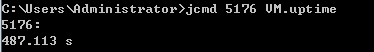
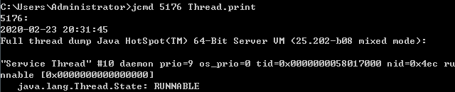

jvisualvm其实就是这些命令的集合，显示为图形化


### jmap

```jmap [option] <pid>
jmap [option] <pid>   // 参数 ， 进程 id
```

获取 jvm 进程 id。其实就是 java.exe 的进程id。在win上cmd命令 tasklist，快捷方式就是 jps。


##### 1、jmap -clstats PID  打印类加载器数据。

类加载器，类，字节，父类加载器，是否存活，类型


注：internal 是因为启动类加载器地层是 c++ 编写的。


##### 2、jmap -heap PID  打印堆的信息


***

### **jstat**

jstat -gc LVMID 用来打印元空间的信息。（LVMID 这里就是 java.exe 的进程号）


MC：当前元空间容量。 MU：已经被使用的元空间的大小


以下这段代码并不会增大元空间内存，因为元数据并没有增加。除非是动态代理这样不断的生成元数据。

```java
public class MyTest5 {
    public static void main(String[] args) {
        for(;;){
            System.out.println("hello world");
        }
    }
}
```

***

### **jcmd**

jcmd 是从jdk1.7 开始增加的命令。

##### 1、jcmd pid VM.flags   打印进程的所有的 vm 参数


##### 2、jcmd pid help    列出当前运行的java进程可以执行的操作


##### 3、jcmd pid help command    查看具体命令的选项有哪些


##### 4、jcmd pid PerfCounter.print      查看JVM性能相关的参数


##### 5、jcmd pid VM.uptime     查看 JVM 的启动时长




##### 6、jcmd pid GC.class_histogram     查看当前系统中类的统计信息


##### 7、jcmd pid Thread.print      查看线程的堆栈信息




##### 8、jcmd pid GC.heap_dump 文件路径           导出Heap dump 文件。

和之前的 jvisualvm 一样，可以打开这个文件。


##### 9、 jcmd pid VM.system_properties      查看JVM 的属性信息


##### 9、jcmd pid VM.version  	 查看目标 JVM 进程的版本信息。（和jdk版本不是一个东西）


##### 10、jcmd pid VM.command_line  查看JVM启动的命令行参数信息


***

### jstack

##### jstack pid  可以查看或者是导出Java应用程序中线程的堆栈信息

和 jcmd pid Thread.print 命令效果一样。


***

### jhat

##### jhat 文件路径        对堆转储文件进行分析。

和 jvisualvm 分析转储文件的作用是一样的。差不多也是被 jvisualvm 集成的命令工具。


***

### jps

会列出来当前操作系统中所有的 java 进程。


jps -l  显示进程所在的包名。（最常用的也是这个参数）


***

### JMC

Oracle Java Mission Control 是一个用于对 Java 应用程序进行管理、监视、概要分析和故障排除的工具套件。首次安装时，Java Mission Control 包括 JMX 控制台和 Java 飞行记录器。从 Mission Control 中可以轻松安装更多插件。 

java 飞行记录器 （jfr : Java Flight Recorder）。

#### jmc：

这里是集成了命令行工具，尤其是诊断命令，就是 jcmd 的图形化界面。


#### jfr：

